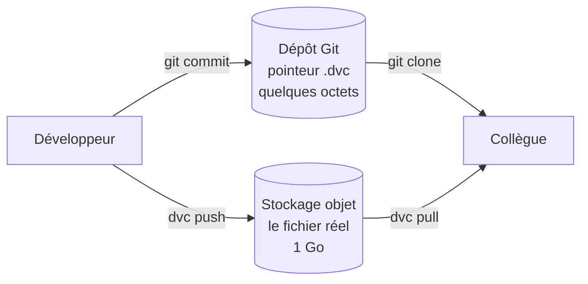

# DataOps

::: tip 🧭 Module d'ouverture — hors progression
**À la fin, vous savez :**

- expliquer pourquoi les données ne se versionnent pas comme le code ;
- lire un **contrat de données** et comprendre ce qu'il garantit ;
- faire échouer une CI sur des données non conformes, comme sur un test rouge ;
- situer DVC et le principe du pointeur versionné.

**Prérequis :** [Les évolutions du métier](/aller-plus-loin/) et [Analyse statique & quality gate](/qualite/analyse-statique).
:::

Le **DataOps** applique aux données ce que le bloc 7 a appliqué au code : des contrôles automatiques, exécutés à chaque livraison, qui **refusent** ce qui n'est pas conforme.

## Le problème : Git n'est pas fait pour les données

Vous avez pris l'habitude de tout commiter. Essayez avec un fichier de données :

| Propriété | Code | Données |
| --- | --- | --- |
| Taille | quelques Ko | du Mo au To |
| Diff | lisible ligne à ligne | illisible |
| Évolution | par un commit humain | **toute seule**, chaque nuit |
| Contenu | public dans le dépôt | souvent personnel, à protéger |

Git stocke **chaque version en entier**. Dix versions d'un fichier d'un gigaoctet, c'est un dépôt de dix gigaoctets que chaque clone rapatrie. Et un `git diff` sur un CSV de deux millions de lignes n'apprend rien à personne.

::: danger Ne commitez jamais des données de production
Un extract contenant des noms, adresses ou identifiants n'a rien à faire dans un dépôt — a fortiori public. Et comme pour un secret, le retirer d'un commit **ne suffit pas** : il reste dans l'historique et dans tous les clones. C'est exactement le raisonnement de la [séance 18](/securite/codeql-secrets), appliqué aux données personnelles.
:::

## La réponse : versionner un pointeur

L'idée de **DVC** (*Data Version Control*) est simple : Git versionne un petit fichier texte qui **décrit** la donnée ; la donnée elle-même vit ailleurs (stockage objet, disque partagé).

```bash
dvc init
dvc add donnees/reference.csv
```

DVC crée alors un fichier de quelques lignes, lui bien adapté à Git :

```yaml
# donnees/reference.csv.dvc
outs:
  - md5: a3f1c9e2b7d4...
    size: 1048576
    path: reference.csv
```

```bash
git add donnees/reference.csv.dvc donnees/.gitignore
git commit -m "data: jeu de référence v1"
```



Le bénéfice est le même que pour le code : `git checkout` d'un ancien commit **plus** `dvc checkout` restitue le couple exact code + données d'alors. Sans cela, impossible de reproduire un résultat de l'an dernier.

## Le contrat de données

C'est la pratique la plus immédiatement utile, et celle qui ne demande aucun outil nouveau. Un **contrat de données** énonce ce que toute livraison doit respecter — colonnes, bornes, complétude — dans un fichier versionné et **relu en Pull Request**.

`donnees/contrat.yml` :

```yaml
colonnes_obligatoires:
  - MedInc
  - HouseAge
  - AveRooms
  - Population
  - MedHouseVal

regles:
  - colonne: MedHouseVal
    min: 0.0
    max: 6.0
    valeurs_manquantes_tolerees: 0
  - colonne: HouseAge
    min: 1
    max: 60
    valeurs_manquantes_tolerees: 0
  - colonne: Population
    min: 1
    max: 40000
    valeurs_manquantes_tolerees: 0

lignes_minimum: 1000
```

Ce fichier est un **objet de négociation** : les bornes viennent du métier, pas du développeur. Le jour où le fournisseur de données change une règle, le diff sur ce fichier rend le changement visible et discutable — au même titre qu'une signature de méthode.

### Le script qui le fait respecter

`src/valider_donnees.py` — l'essentiel tient en une trentaine de lignes :

```python
def valider(chemin_donnees: Path, chemin_contrat: Path) -> list[str]:
    donnees = pd.read_csv(chemin_donnees)
    contrat = yaml.safe_load(chemin_contrat.read_text(encoding="utf-8"))
    anomalies: list[str] = []

    manquantes = set(contrat["colonnes_obligatoires"]) - set(donnees.columns)
    if manquantes:
        anomalies.append(f"colonnes absentes : {sorted(manquantes)}")

    if len(donnees) < contrat["lignes_minimum"]:
        anomalies.append(
            f"{len(donnees)} lignes, minimum attendu {contrat['lignes_minimum']}")

    for regle in contrat["regles"]:
        col = regle["colonne"]
        if col not in donnees.columns:
            continue
        serie = donnees[col]

        vides = int(serie.isna().sum())
        if vides > regle["valeurs_manquantes_tolerees"]:
            anomalies.append(f"{col} : {vides} valeur(s) manquante(s)")

        hors_bornes = int(((serie < regle["min"]) | (serie > regle["max"])).sum())
        if hors_bornes:
            anomalies.append(
                f"{col} : {hors_bornes} valeur(s) hors de [{regle['min']} ; {regle['max']}]")

    return anomalies
```

Le point décisif est la **sortie en code 1** quand le contrat est violé : le script se comporte comme un test unitaire, et la CI devient rouge.

## À exécuter

**Cas 1 — des données conformes :**

```bash
python src/valider_donnees.py donnees/reference.csv
```

```text
Contrôle de reference.csv
  ✅ contrat respecté
```
Code de sortie : `0`.

**Cas 2 — des données corrompues.** Abîmez volontairement le fichier :

```python
import pandas as pd
d = pd.read_csv('donnees/reference.csv')
d.loc[0:4, 'MedHouseVal'] = 99.0      # hors bornes
d.loc[10:12, 'Population'] = None      # valeurs manquantes
d.to_csv('donnees/cassees.csv', index=False)
```

```bash
python src/valider_donnees.py donnees/cassees.csv
```

```text
Contrôle de cassees.csv
  ❌ MedHouseVal : 5 valeur(s) hors de [0.0 ; 6.0]
  ❌ Population : 3 valeur(s) manquante(s)

2 violation(s) du contrat de données.
```
Code de sortie : `1`.

C'est exactement le déroulé du [TP 4](/tp/tp4-qualite-ci) — rouge, puis vert — transposé aux données. Le pipeline ne signale pas : il **refuse**.

::: tip La démonstration applique ce qu'elle enseigne
Regardez le `.gitignore` de `demo/dataops-mlops/` : `donnees/*.csv`, `mlflow.db`, `mlruns/` y sont **exclus**. Aucune donnée, aucun modèle n'est versionné — tout se régénère depuis `recuperer.py`. Le dépôt ne contient que ce qui produit les données, jamais les données elles-mêmes.
:::

## Dans la CI

```yaml
name: Qualité des données

on:
  pull_request:
    paths: ['donnees/**']
  schedule:
    - cron: '0 6 * * *'      # les données changent sans commit : on vérifie chaque jour

permissions:
  contents: read

jobs:
  contrat:
    runs-on: ubuntu-latest
    steps:
      - uses: actions/checkout@v4
      - uses: actions/setup-python@v5
        with:
          python-version: '3.11'
          cache: 'pip'
      - run: pip install pandas pyyaml
      - name: Vérifier le contrat de données
        run: python src/valider_donnees.py donnees/reference.csv
```

::: tip Le déclencheur `schedule` est ici essentiel
Pour le code, une vérification à chaque Pull Request suffit : le code ne change que lorsqu'on le modifie. **Les données, elles, changent toutes seules** — un fournisseur modifie un format, une source se tarit, un capteur dérive. Sans exécution planifiée, on découvre le problème quand le tableau de bord affiche n'importe quoi.
:::

## Ce que le DataOps recouvre au-delà

Le contrat n'est que la porte d'entrée. Dans une équipe qui pratique le DataOps, on trouve aussi :

| Pratique | Ce qu'elle apporte |
| --- | --- |
| **Orchestration** de pipelines | Enchaîner extraction, transformation, chargement avec reprise sur erreur |
| **Traçabilité** (*lineage*) | Savoir de quelle source provient chaque chiffre d'un tableau de bord |
| **Environnements séparés** | Un jeu d'essai anonymisé pour développer, jamais la production |
| **Fraîcheur** | Alerter quand une source cesse d'être mise à jour — la panne la plus silencieuse |

---

## Auto-évaluation

Répondez de mémoire avant de déplier la correction.

::: details 1. Pourquoi DVC versionne-t-il un pointeur plutôt que le fichier ?
Parce que Git conserve chaque version intégralement : versionner directement un fichier volumineux ferait exploser la taille du dépôt et de chaque clone. Le pointeur `.dvc` ne contient qu'une empreinte et une taille — quelques octets — pendant que le fichier réel vit dans un stockage adapté. On garde la reproductibilité (`git checkout` + `dvc checkout` restituent le couple exact) sans les inconvénients.
:::

::: details 2. Pourquoi vérifier les données selon un `schedule`, et pas seulement sur les Pull Requests ?
Parce que les données changent **sans commit**. Le code ne bouge que si quelqu'un le modifie, donc une vérification à chaque PR le couvre entièrement. Une source de données peut changer de format, se vider ou se corrompre pendant la nuit sans qu'aucun développeur n'ait rien fait. Sans exécution planifiée, la CI reste verte alors que les données sont déjà fausses.
:::

::: details 3. Qui devrait fixer les bornes du contrat de données ?
Le **métier**, pas le développeur. Savoir qu'une valeur de logement ne dépasse pas un certain seuil, ou qu'un âge de bâtiment reste dans une plage, relève de la connaissance du domaine. Le développeur outille la vérification ; il n'invente pas la règle. C'est d'ailleurs l'intérêt d'un fichier versionné : il rend la règle explicite, relisible et discutable en revue.
:::

**Critères de réussite**

- ☐ le script rend `0` sur des données conformes et `1` sur des données corrompues
- ☐ je sais expliquer ce que contient un fichier `.dvc` et pourquoi
- ☐ je peux justifier le déclencheur `schedule` sur un contrôle de données

Passons aux modèles : [MLOps](/aller-plus-loin/mlops).
