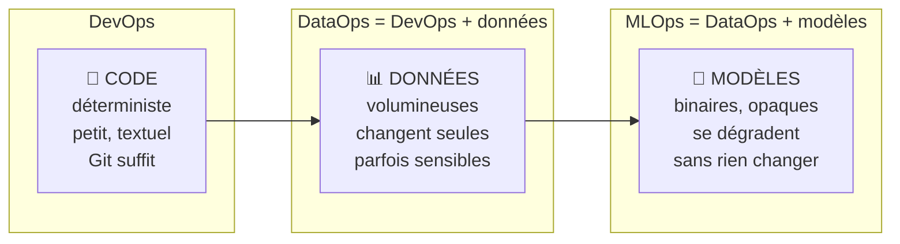

# Les évolutions du métier

::: tip 🧭 Module d'ouverture — hors progression
Ce module ne porte pas de numéro de séance : il ne fait pas partie des 32 séances et **peut être sauté sans conséquence**. Il est prévu pour une lecture en autonomie, un projet libre, ou des étudiants en avance.

**À la fin, vous savez :**

- expliquer ce que DataOps et MLOps ajoutent au DevOps, et pourquoi ;
- nommer les réflexes DevOps qui **cessent de fonctionner** dès qu'on manipule des données ou des modèles ;
- exécuter une démonstration complète et interpréter ce qu'elle affiche.

**Prérequis :** avoir suivi les blocs [Automatiser](/actions/) et [Qualité & tests](/qualite/).
**Durée indicative :** 1 h de lecture, 30 min de manipulation.
:::

Vous avez passé trente-deux séances à faire une chose : **rendre le logiciel reproductible et vérifiable**. Versionner, tester, construire, livrer, surveiller. Ces pratiques ont un nom — DevOps — et elles reposent sur une hypothèse discrète.

Cette hypothèse, c'est que **le code est la seule chose qui change**.

Dès qu'un système apprend à partir de données, elle tombe. C'est de là que viennent le **DataOps** et le **MLOps** : non pas des modes, mais la réponse à des problèmes que les outils du bloc 4 ne savent pas traiter.

## Une seule idée : trois choses à gouverner



DevOps gouverne le code. DataOps y ajoute les données. MLOps y ajoute les modèles. **Chaque ajout casse un réflexe** que vous avez acquis :

| Votre réflexe DevOps | Ce qui le met en échec | La réponse |
| --- | --- | --- |
| « Je versionne tout dans Git » | Un fichier de données fait 4 Go, Git plie | Versionner un **pointeur**, stocker la donnée ailleurs ([DVC](/aller-plus-loin/dataops)) |
| « Le dépôt contient tout ce qu'il faut » | Les données de production sont personnelles, on ne les commite pas | **Contrats de données** et jeux d'essai anonymisés |
| « Si les tests passent, ça marche » | Le code est intact, mais la source a changé de format | Tests **sur les données**, pas seulement sur le code |
| « Une même entrée donne une même sortie » | Un entraînement dépend d'un aléa et de l'ordre des données | Fixer les **graines**, journaliser l'expérience |
| « Le programme ne se dégrade pas tout seul » | Le modèle perd en précision parce que **le monde a bougé** | Détection de **dérive** et réentraînement |

La dernière ligne est la plus importante. Un programme classique qu'on ne touche pas fait la même chose dans un an. Un modèle qu'on ne touche pas devient **faux** — sans erreur, sans exception, sans alerte. C'est un type de panne que rien dans votre formation ne vous a encore appris à voir.

## Où cela se pratique

Ces pratiques ne sont pas réservées aux géants du numérique. Un développeur BTS SIO les croise sous des formes très concrètes :

| Situation courante | Ce qui relève du DataOps / MLOps |
| --- | --- |
| Un import quotidien de fichiers clients | Valider le format **avant** de charger, alerter sur les anomalies |
| Un tableau de bord alimenté par plusieurs sources | Tracer d'où vient chaque chiffre, détecter une source muette |
| Un moteur de recommandation ou de scoring | Surveiller que ses résultats restent pertinents dans le temps |
| Une fonctionnalité qui appelle une IA générative | Versionner les invites, mesurer la qualité des réponses, maîtriser le coût |

::: tip Et l'IA générative ?
Le même raisonnement s'étend aux applications bâties sur des modèles de langage — on parle parfois de **LLMOps**. Les objets changent (invites, jeux d'évaluation, coût par appel), la logique est identique : versionner ce qui influence le résultat, mesurer la qualité en continu, savoir revenir en arrière. Si vous avez compris le MLOps, vous avez compris l'essentiel.
:::

## Ce que vous allez manipuler

Les deux pages suivantes s'appuient sur une **démonstration prête à l'emploi**, en Python. Vous n'avez ni Python ni *machine learning* à apprendre : les scripts sont fournis, vous les exécutez et vous **lisez ce qu'ils affichent**. L'objectif est de voir les mécanismes, pas de savoir les écrire.

Les scripts sont dans le dépôt du cours, sous [`demo/dataops-mlops/`](https://github.com/ggaillard/cours-devops/tree/main/demo/dataops-mlops) :

```
demo/dataops-mlops/
├── donnees/
│   ├── recuperer.py         récupère un jeu de données public
│   └── contrat.yml          le contrat que les données doivent respecter
└── src/
    ├── valider_donnees.py   DataOps  : refuse des données non conformes
    ├── entrainer.py         MLOps    : entraîne et journalise l'expérience
    └── detecter_derive.py   MLOps    : compare production et entraînement
```

### Préparer l'environnement

Dans un [Codespace](/codespaces/), ajoutez Python à votre Dev Container :

```json
{
  "features": {
    "ghcr.io/devcontainers/features/python:1": { "version": "3.11" }
  },
  "postCreateCommand": "pip install pandas scikit-learn scipy pyyaml mlflow"
}
```

Puis, après un **Rebuild Container** :

```bash
cd demo/dataops-mlops
pip install -r requirements.txt
python donnees/recuperer.py     # récupère et prépare les données
```

Le jeu utilisé est un jeu **public** fourni avec scikit-learn (prix de logements en Californie, 20 640 lignes). Le domaine importe peu : ce sont les pratiques qui comptent, et elles seraient identiques sur vos données d'interventions.

::: warning Le temps d'exécution
L'ensemble de la démonstration tourne en moins de 20 secondes. Si l'entraînement dure plusieurs minutes, c'est que le Codespace est sous-dimensionné — réduisez `n_estimators` dans `entrainer.py`.
:::

---

## Auto-évaluation

Répondez de mémoire avant de déplier la correction.

::: details 1. En une phrase, qu'ajoute le MLOps au DevOps ?
La gouvernance de deux objets supplémentaires : les **données** et les **modèles**. Le DevOps sait rendre le code reproductible ; le MLOps doit en plus rendre reproductible un résultat qui dépend de données changeantes et d'un entraînement partiellement aléatoire — et surveiller un artefact qui se dégrade sans que personne n'y touche.
:::

::: details 2. Pourquoi ne peut-on pas simplement commiter ses données dans Git ?
Pour trois raisons cumulées. La **taille** : Git stocke chaque version intégralement, un fichier de plusieurs gigaoctets rend le dépôt inutilisable. La **confidentialité** : des données de production contiennent souvent des informations personnelles, qui n'ont rien à faire dans un dépôt cloné par toute l'équipe. Et la **nature du diff** : comparer deux versions d'un CSV de millions de lignes ne produit rien de lisible.
:::

::: details 3. Un modèle en production n'a pas été modifié depuis six mois et donne de moins bons résultats. Comment est-ce possible ?
Parce que **le monde a changé, pas le programme**. Le modèle a appris des régularités sur des données passées ; si la population, les prix, les usages ou la saison évoluent, les données entrantes ne ressemblent plus à celles de l'entraînement — c'est la **dérive**. Le code est intact, les tests passent, et pourtant les prédictions se dégradent. Seule une surveillance des données et des performances permet de le détecter.
:::

**Ce module est-il pour vous ?**

- ☐ je sais dire ce que DataOps ajoute au DevOps, et ce que MLOps y ajoute encore
- ☐ je peux citer deux réflexes DevOps mis en échec par les données
- ☐ je comprends qu'un modèle puisse se dégrader sans modification de code

Commençons par les données : [DataOps](/aller-plus-loin/dataops).
