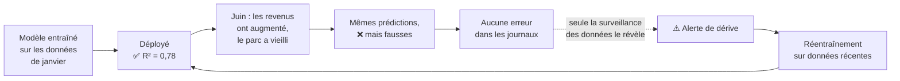
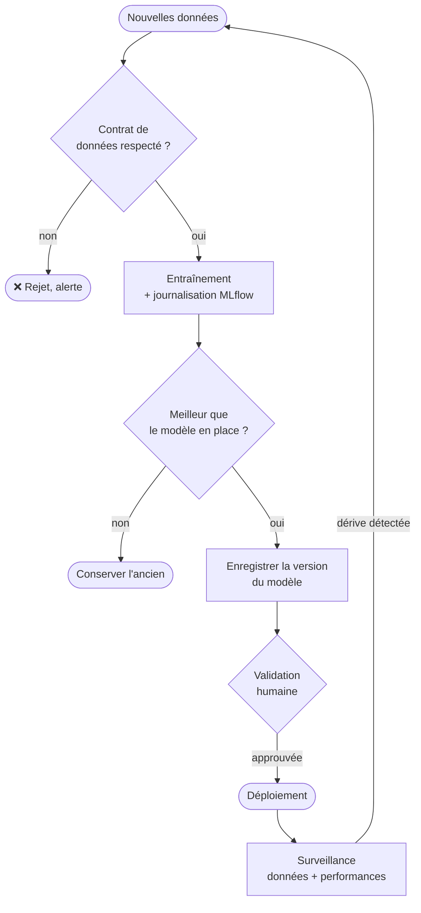

# MLOps

::: tip 🧭 Module d'ouverture — hors progression
**À la fin, vous savez :**

- expliquer pourquoi un entraînement doit être **journalisé** pour être reproductible ;
- lire une expérience MLflow : paramètres, métriques, empreinte des données ;
- comprendre ce qu'est la **dérive** et comment un test statistique la détecte ;
- décrire ce que devient un pipeline CI/CD quand il livre un modèle.

**Prérequis :** [DataOps](/aller-plus-loin/dataops).
:::

Le **MLOps** répond à un problème que le DevOps n'a jamais eu à traiter : un artefact qui **se dégrade tout seul**.

## Trois différences avec un programme ordinaire

| | Un programme | Un modèle |
| --- | --- | --- |
| **Origine** | écrit par un humain | **produit** par un entraînement |
| **Lisibilité** | le code se lit et se relit en PR | un fichier binaire de poids, illisible |
| **Vieillissement** | fait la même chose dans un an | devient **faux** quand le monde change |

La deuxième ligne a une conséquence pratique immédiate : on ne peut pas relire un modèle en Pull Request. Ce qu'on relit, ce sont **les conditions de sa production** — les données, les paramètres, le code d'entraînement. D'où l'importance de tout journaliser.

## Reproduire un entraînement

Un même script d'entraînement lancé deux fois peut produire deux modèles différents : l'ordre des données, l'initialisation aléatoire, une version de bibliothèque. Trois précautions rendent le résultat reproductible :

1. **Fixer les graines aléatoires** (`random_state=42`) ;
2. **Enregistrer l'empreinte des données** utilisées ;
3. **Journaliser** paramètres, métriques et environnement.

`src/entrainer.py` :

```python
import hashlib
import mlflow
import mlflow.sklearn
import pandas as pd
from sklearn.ensemble import RandomForestRegressor
from sklearn.metrics import mean_absolute_error, r2_score
from sklearn.model_selection import train_test_split

def empreinte(chemin: Path) -> str:
    """Identifie la version exacte des données utilisées."""
    return hashlib.sha256(chemin.read_bytes()).hexdigest()[:12]

chemin = RACINE / "donnees" / "reference.csv"
donnees = pd.read_csv(chemin)
X, y = donnees.drop(columns=[CIBLE]), donnees[CIBLE]
X_tr, X_te, y_tr, y_te = train_test_split(X, y, test_size=0.2, random_state=42)

parametres = {"n_estimators": 60, "max_depth": 12, "random_state": 42}

mlflow.set_tracking_uri(f"sqlite:///{RACINE / 'mlflow.db'}")
mlflow.set_experiment("prix-logements")

with mlflow.start_run() as execution:
    modele = RandomForestRegressor(**parametres).fit(X_tr, y_tr)
    prediction = modele.predict(X_te)

    mlflow.log_params(parametres)
    mlflow.log_param("donnees_empreinte", empreinte(chemin))   # ← la clé de la reproductibilité
    mlflow.log_metrics({
        "mae": mean_absolute_error(y_te, prediction),
        "r2": r2_score(y_te, prediction),
    })
    mlflow.sklearn.log_model(modele, name="modele")
```

::: tip La ligne qui compte
`log_param("donnees_empreinte", ...)`. Sans elle, vous savez qu'un modèle a obtenu un R² de 0,78 — sans savoir **sur quelles données**. Six mois plus tard, impossible de reproduire ou d'expliquer le résultat. Cette empreinte joue pour les données le rôle que le SHA du commit joue pour le code.
:::

```bash
python src/entrainer.py
```

```text
exécution   : bc92092b
données     : 37faf252cfa0
MAE         : 0.3745
R²          : 0.7753
```

Chaque exécution est enregistrée. Pour les comparer dans une interface :

```bash
mlflow ui --backend-store-uri sqlite:///mlflow.db
```

Le port s'ouvre dans le Codespace comme n'importe quel serveur web ([séance 5](/codespaces/premier-codespace)). Modifiez `n_estimators`, relancez, et comparez les exécutions : c'est le quotidien d'un travail sur modèle.

::: warning Le stockage fichier de MLflow est déprécié
Les tutoriels anciens écrivent `mlflow.set_tracking_uri("file://./mlruns")`. Depuis MLflow 3, ce mode lève une exception : il faut une base, `sqlite:///mlflow.db` étant le choix minimal. Un bon rappel que dans ce domaine, un tutoriel de trois ans est souvent périmé — vérifiez toujours contre la documentation officielle.
:::

## La dérive : la panne sans erreur

C'est le concept central de cette page. Un modèle entraîné sur les données d'hier prédit mal les données d'aujourd'hui **si le monde a changé**. Aucune exception n'est levée, aucun test ne casse : les prédictions sont simplement moins bonnes.



### Comment on la détecte

En comparant les **distributions** : celles sur lesquelles le modèle a appris, et celles qui arrivent en production. Le test de **Kolmogorov-Smirnov** répond à « ces deux échantillons viennent-ils de la même loi ? » et renvoie une *p-value*. En dessous de 0,05, on considère que non.

```python
from scipy.stats import ks_2samp

for col in colonnes:
    resultat = ks_2samp(reference[col].dropna(), courant[col].dropna())
    derive = resultat.pvalue < SEUIL_P
```

## À exécuter

La démonstration fournit deux jeux de production : l'un comparable, l'autre après un changement du monde (revenus en hausse, parc immobilier vieillissant).

**Cas 1 — rien n'a changé :**

```bash
python src/detecter_derive.py courant_stable.csv
```

```text
colonne            p-value   verdict
----------------------------------------------
MedInc            6.67e-01   stable
HouseAge          5.85e-01   stable
AveRooms          2.37e-01   stable
...
0/8 colonnes ont dérivé (0%)

✅ Les données de production ressemblent aux données d'entraînement.
```

**Cas 2 — le monde a bougé :**

```bash
python src/detecter_derive.py courant_derive.csv
```

```text
colonne            p-value   verdict
----------------------------------------------
MedInc           1.40e-184   ⚠️  DÉRIVE
HouseAge         5.04e-290   ⚠️  DÉRIVE
AveRooms          2.37e-01   stable
AveBedrms         1.20e-01   stable
Population        4.22e-01   stable
AveOccup          4.84e-01   stable
Latitude          1.82e-01   stable
Longitude         3.73e-01   stable
----------------------------------------------
2/8 colonnes ont dérivé (25%)

⚠️  Dérive localisée sur : MedInc, HouseAge
```

Observez que le détecteur **discrimine** : il ne crie pas au loup sur le cas stable, et il désigne précisément les deux variables modifiées. Un détecteur qui alerterait toujours serait aussi inutile qu'un test qui échoue au hasard — c'est le même raisonnement qu'au [TP 4](/tp/tp4-qualite-ci).

::: warning Le seuil est une décision, pas une vérité
Faut-il réentraîner dès qu'une colonne dérive, ou attendre qu'un tiers d'entre elles bougent ? La réponse dépend du coût d'un réentraînement et du risque d'une mauvaise prédiction. C'est une décision **métier**, à écrire et à assumer — exactement comme le seuil de couverture de la [séance 21](/qualite/couverture).
:::

En production, on surveille aussi la **dérive des performances** : quand la vérité finit par être connue — le prix réel, l'incident réellement survenu — on compare a posteriori. C'est le signal le plus fiable, mais il arrive avec du retard, d'où l'intérêt de surveiller d'abord les données entrantes. L'outil de référence pour l'ensemble est **Evidently**, une bibliothèque Python qui produit ces rapports automatiquement.

## Le pipeline complet



Comparez-le au pipeline du [TP 5](/tp/tp5-api-livree) : la structure est identique — vérifier, construire, valider, livrer, surveiller. Deux différences seulement, mais elles changent tout :

- **la condition de livraison** n'est pas « les tests passent » mais « le nouveau modèle est meilleur que l'ancien » ;
- **la boucle se referme sur la production** : la surveillance déclenche un nouveau cycle, sans qu'aucun développeur n'ait écrit une ligne.

C'est le sens plein de la boucle DevOps vue à la [séance 1](/introduction/) — ici, elle tourne vraiment toute seule.

---

## Auto-évaluation

Répondez de mémoire avant de déplier la correction.

::: details 1. Pourquoi journaliser l'empreinte des données à chaque entraînement ?
Parce que le modèle est le produit d'un couple **code + données**. Le SHA du commit identifie le code ; sans empreinte, rien n'identifie les données. Six mois plus tard, face à un modèle qui affichait un bon score, on serait incapable de reproduire le résultat ni d'expliquer un écart. C'est l'équivalent, pour les données, de ce que Git fait pour le code.
:::

::: details 2. Que signifie une p-value de 1,4 × 10⁻¹⁸⁴ sur une colonne ?
Que la probabilité d'observer un tel écart entre les deux échantillons **si leurs distributions étaient identiques** est astronomiquement faible. Autrement dit : les données de production sur cette variable n'ont plus rien à voir avec celles de l'entraînement. Le modèle extrapole hors de ce qu'il connaît, et ses prédictions ne sont plus fiables.
:::

::: details 3. En quoi la condition de déploiement diffère-t-elle d'un pipeline logiciel classique ?
En logiciel, la condition est binaire et objective : les tests passent, la couverture tient, on livre. Pour un modèle, elle est **comparative** : on ne déploie que si le nouveau fait mieux que celui en place, sur un jeu d'évaluation figé. Un modèle peut être parfaitement fonctionnel et pourtant refusé, simplement parce qu'il n'apporte rien.
:::

::: details 4. La CI est verte, aucune erreur dans les journaux, et pourtant les prédictions sont mauvaises. Par où commencer ?
Par comparer les données entrantes à celles de l'entraînement — c'est le scénario typique de la dérive. Le code étant intact, ni les tests ni les journaux ne peuvent rien signaler : la panne n'est pas dans le programme, elle est dans l'écart entre le monde appris et le monde actuel. C'est précisément le type d'incident que la surveillance MLOps existe pour rendre visible.
:::

**Critères de réussite**

- ☐ deux exécutions successives apparaissent dans `mlflow ui` et se comparent
- ☐ je sais retrouver, pour une exécution, sur quelles données elle a été faite
- ☐ le détecteur répond « stable » sur un cas, et désigne les colonnes fautives sur l'autre
- ☐ je peux expliquer pourquoi un modèle se dégrade sans modification de code

Vous avez fait le tour de ce que le DevOps devient quand il rencontre les données. Retour au [parcours](/introduction/parcours).
