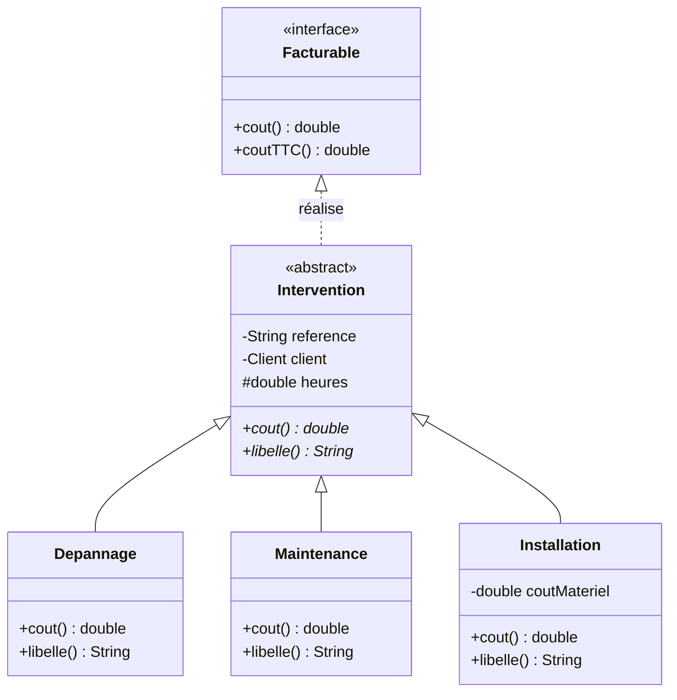
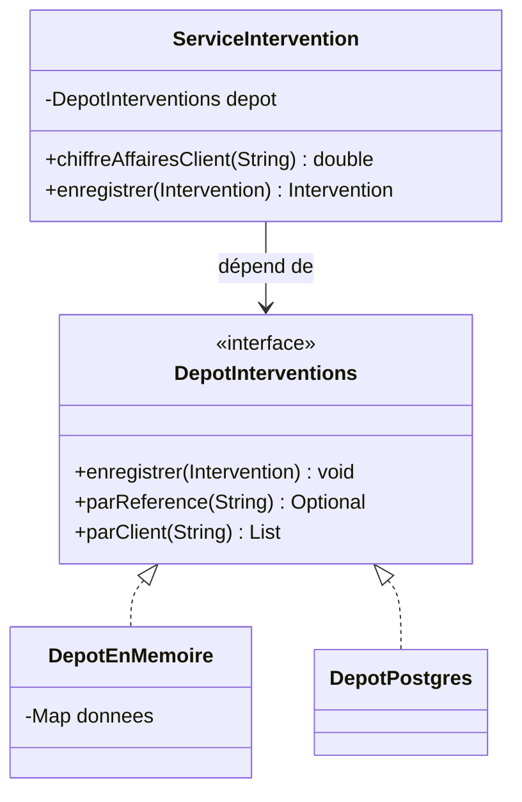

# Abstraction & polymorphisme

::: info 🎯 Séance 28 · 2 h
À la fin de cette séance, vous savez :

- distinguer généralisation et réalisation, au diagramme comme en Java ;
- remplacer une cascade de conditions par du polymorphisme ;
- choisir entre classe abstraite et interface ;
- dépendre d'une abstraction, et le rendre visible sur le diagramme.

**Prérequis :** [Associations & cycle de vie](/api-java/associations-cycle-vie)

**Livrable attendu :** une hiérarchie d'interventions polymorphe, son diagramme, et un service testable sans base de données
:::

L'encapsulation protège l'état. Le **polymorphisme** organise le comportement. C'est ce qui distingue une conception objet d'un programme procédural écrit avec des classes.

## Généralisation et réalisation

Deux relations verticales, souvent confondues, et qui se distinguent au trait :

| Notation | Nom | Sens | Java |
| --- | --- | --- | --- |
| `<\|--` trait **plein** | **Généralisation** | « est un » | `extends` |
| `<\|..` trait **pointillé** | **Réalisation** | « sait faire » | `implements` |

`Depannage` **est une** `Intervention` : généralisation. `Intervention` **sait être** `Facturable` : réalisation. Les deux flèches montent vers l'élément le plus général — c'est la nature du trait qui les sépare.

Voici la cible de la séance :



Trois conventions à repérer :

- **`<<abstract>>` et `<<interface>>`** sont des stéréotypes : ils précisent la nature de l'élément.
- **Une opération suivie d'une `*`** (en italique dans la notation officielle) est **abstraite** : déclarée sans corps, chaque sous-classe doit la fournir. C'est le cas de `cout()` et `libelle()`.
- **`#heures`** est `protected` : accessible aux sous-classes qui en ont besoin pour calculer, fermé au reste du monde.

Ce diagramme tient en quinze lignes et remplace trois pages d'explications. Il dit aussi ce qu'il faut coder — passons-y.

## Le problème : la cascade de `if`

Trois types d'intervention se facturent différemment. Version naïve :

```java
public class CalculateurCout {
    public double calculer(Intervention i) {
        if (i.getType().equals("DEPANNAGE")) {
            return 90 * i.getHeures() + 50;              // forfait déplacement
        } else if (i.getType().equals("MAINTENANCE")) {
            return 70 * i.getHeures() * 0.9;             // remise contrat
        } else if (i.getType().equals("INSTALLATION")) {
            return 110 * i.getHeures() + i.getMateriel();
        }
        throw new IllegalStateException("type inconnu : " + i.getType());
    }
}
```

Ce code fonctionne. Il pose trois problèmes :

- **Ajouter un type impose de modifier cette classe**, et toutes celles qui contiennent une cascade semblable — souvent dispersées dans l'application.
- **Le compilateur ne vous aide pas.** Oublier un `else if` produit une exception à l'exécution, en production.
- **Les données et le comportement sont séparés.** `Intervention` doit exposer `getHeures()`, `getMateriel()`, `getType()` : l'encapsulation de la séance 26 est perdue.

## La solution : le polymorphisme

Chaque type sait calculer son propre coût.

```java
package fr.btssio.interventions.domaine;

import java.time.LocalDate;
import java.util.Objects;

public abstract class Intervention {

    private final String reference;
    private final Client client;
    private final LocalDate date;
    private final double heures;

    protected Intervention(String reference, Client client, LocalDate date, double heures) {
        this.reference = Objects.requireNonNull(reference);
        this.client    = Objects.requireNonNull(client);
        this.date      = Objects.requireNonNull(date);
        if (heures <= 0) {
            throw new IllegalArgumentException("durée invalide : " + heures);
        }
        this.heures = heures;
    }

    /** Chaque type d'intervention définit sa propre tarification. */
    public abstract double cout();

    /** Libellé affiché à l'utilisateur. */
    public abstract String libelle();

    public String reference()  { return reference; }
    public Client client()     { return client; }
    public LocalDate date()    { return date; }
    protected double heures()  { return heures; }
}
```

Les trois sous-classes :

```java
public class Depannage extends Intervention {

    private static final double TAUX_HORAIRE = 90;
    private static final double FORFAIT_DEPLACEMENT = 50;

    public Depannage(String reference, Client client, LocalDate date, double heures) {
        super(reference, client, date, heures);
    }

    @Override
    public double cout() {
        return TAUX_HORAIRE * heures() + FORFAIT_DEPLACEMENT;
    }

    @Override
    public String libelle() {
        return "Dépannage sur site";
    }
}
```

```java
public class Maintenance extends Intervention {

    private static final double TAUX_HORAIRE = 70;
    private static final double REMISE_CONTRAT = 0.10;

    public Maintenance(String reference, Client client, LocalDate date, double heures) {
        super(reference, client, date, heures);
    }

    @Override
    public double cout() {
        return TAUX_HORAIRE * heures() * (1 - REMISE_CONTRAT);
    }

    @Override
    public String libelle() {
        return "Maintenance préventive";
    }
}
```

```java
public class Installation extends Intervention {

    private static final double TAUX_HORAIRE = 110;
    private final double coutMateriel;

    public Installation(String reference, Client client, LocalDate date,
                        double heures, double coutMateriel) {
        super(reference, client, date, heures);
        if (coutMateriel < 0) {
            throw new IllegalArgumentException("coût matériel négatif");
        }
        this.coutMateriel = coutMateriel;
    }

    @Override
    public double cout() {
        return TAUX_HORAIRE * heures() + coutMateriel;
    }

    @Override
    public String libelle() {
        return "Installation de matériel";
    }
}
```

L'appelant ne connaît plus aucun type concret :

```java
double total = interventions.stream()
        .mapToDouble(Intervention::cout)     // chaque objet applique SA règle
        .sum();
```

::: tip Ce que le polymorphisme a supprimé
La cascade de `if` a disparu — mais surtout, **ajouter un type ne modifie plus aucun code existant**. On crée une classe, elle s'insère. C'est le principe ouvert/fermé : ouvert à l'extension, fermé à la modification. Et `heures()` a pu redevenir `protected` : l'encapsulation est préservée.
:::

## Classe abstraite ou interface ?

| | Classe abstraite | Interface |
| --- | --- | --- |
| Rôle | « **est un** » : partage un état et du code | « **sait faire** » : contrat de comportement |
| État | Peut porter des champs | Aucun champ d'instance |
| Héritage | Une seule par classe | Autant qu'on veut |
| Au diagramme | `<<abstract>>`, trait plein | `<<interface>>`, trait pointillé |
| Exemple ici | `Intervention` | `Facturable`, `DepotInterventions` |

La règle pratique : une **classe abstraite** quand il y a du code et de l'état à partager entre des variantes d'une même chose ; une **interface** quand on décrit une capacité que des classes très différentes peuvent offrir.

```java
public interface Facturable {
    double cout();
    default double coutTTC() {          // méthode par défaut
        return cout() * 1.20;
    }
}
```

`Intervention` peut implémenter `Facturable` — et un `AbonnementSupport`, qui n'a rien à voir, le peut aussi.

## Dépendre d'une abstraction

Voici le second usage des interfaces, plus structurant encore. Le service qui manipule les interventions doit-il connaître la base de données ?

```java
// ❌ Le service est soudé à une implémentation
public class ServiceIntervention {
    private final DepotPostgres depot = new DepotPostgres();   // impossible à tester
}
```

Définissons d'abord le **contrat**, exprimé dans le vocabulaire du métier :

```java
package fr.btssio.interventions.domaine;

import java.util.List;
import java.util.Optional;

public interface DepotInterventions {
    void enregistrer(Intervention intervention);
    Optional<Intervention> parReference(String reference);
    List<Intervention> parClient(String identifiantClient);
}
```

Le service ne dépend que de lui :

```java
public class ServiceIntervention {

    private final DepotInterventions depot;

    public ServiceIntervention(DepotInterventions depot) {   // injection
        this.depot = Objects.requireNonNull(depot);
    }

    public double chiffreAffairesClient(String identifiantClient) {
        return depot.parClient(identifiantClient).stream()
                .mapToDouble(Intervention::cout)
                .sum();
    }

    public Intervention enregistrer(Intervention intervention) {
        depot.parReference(intervention.reference()).ifPresent(existante -> {
            throw new IllegalStateException(
                    "référence déjà utilisée : " + intervention.reference());
        });
        depot.enregistrer(intervention);
        return intervention;
    }
}
```

C'est l'**inversion de dépendance** : le service ne choisit pas son dépôt, on le lui fournit. Il ignore s'il parle à PostgreSQL, à un fichier ou à une simple `Map`.

## La conception se lit sur le diagramme



Une chose mérite d'être remarquée : `ServiceIntervention` pointe vers l'**interface**, jamais vers une implémentation. C'est l'inversion de dépendance **visible sur le dessin**. Un relecteur qui verrait une flèche du service vers `DepotPostgres` saurait immédiatement que la conception est fautive — sans lire une ligne de code.

## Le bénéfice se voit dans les tests

```java
class ServiceInterventionTest {

    /** Dépôt en mémoire : ni base, ni réseau, ni configuration. */
    private static class DepotEnMemoire implements DepotInterventions {
        private final Map<String, Intervention> donnees = new HashMap<>();

        @Override public void enregistrer(Intervention i) {
            donnees.put(i.reference(), i);
        }
        @Override public Optional<Intervention> parReference(String reference) {
            return Optional.ofNullable(donnees.get(reference));
        }
        @Override public List<Intervention> parClient(String idClient) {
            return donnees.values().stream()
                    .filter(i -> i.client().identifiant().equals(idClient))
                    .toList();
        }
    }

    @Test
    void additionne_le_cout_de_toutes_les_interventions_d_un_client() {
        var service = new ServiceIntervention(new DepotEnMemoire());
        var client = new Client("C1", "Dupont", "d@ex.fr");

        service.enregistrer(new Depannage("I1", client, LocalDate.now(), 2));    // 90×2+50 = 230
        service.enregistrer(new Maintenance("I2", client, LocalDate.now(), 4));  // 70×4×0,9 = 252

        assertEquals(482, service.chiffreAffairesClient("C1"), 0.001);
    }

    @Test
    void refuse_une_reference_deja_utilisee() {
        var service = new ServiceIntervention(new DepotEnMemoire());
        var client = new Client("C1", "Dupont", "d@ex.fr");
        service.enregistrer(new Depannage("I1", client, LocalDate.now(), 1));

        assertThrows(IllegalStateException.class,
                () -> service.enregistrer(new Maintenance("I1", client, LocalDate.now(), 1)));
    }
}
```

Ce test s'exécute en quelques millisecondes, sans base de données, sans conteneur, sans configuration. Il tournera à l'identique sur votre poste et sur le runner. **C'est l'abstraction qui a rendu cela possible** — et c'est ce qui permettra d'atteindre les seuils de couverture de la [séance 21](/qualite/couverture) sans acrobaties.

::: warning Le piège du test qui n'en est pas un
Si le service instanciait lui-même `DepotPostgres`, tester `chiffreAffairesClient` exigerait une vraie base : lente, à préparer, à nettoyer. Beaucoup d'équipes renoncent alors à tester leur logique métier. Le problème n'est pas le test, c'est la conception.
:::

---

## Auto-évaluation

Répondez de mémoire avant de déplier la correction.

::: details 1. Quelle différence entre le trait plein et le trait pointillé montant vers une classe ?
Le trait **plein** est une **généralisation** : « est un », traduite par `extends`. Le trait **pointillé** est une **réalisation** : « sait faire », traduite par `implements`. `Depannage` est une `Intervention` ; `Intervention` sait être `Facturable`. La confusion est fréquente parce que les deux flèches montent — seule la nature du trait les distingue.
:::

::: details 2. Que gagne-t-on concrètement à supprimer la cascade de `if` ?
L'ajout d'un quatrième type ne modifie plus aucun code existant : on écrit une classe, elle s'insère. On supprime aussi le risque d'oublier une branche quelque part dans l'application, et l'on peut refermer l'encapsulation — les getters exposés uniquement pour nourrir le calcul externe redeviennent inutiles.
:::

::: details 3. Classe abstraite ou interface pour représenter « ce qui peut être facturé » ?
Une **interface**, notée `<<interface>>` et reliée par un trait pointillé. « Facturable » est une capacité, pas une nature : une intervention, un abonnement et une formation peuvent tous être facturables sans partager le moindre état. La classe abstraite conviendrait si toutes ces choses étaient des variantes d'un même concept, avec du code commun.
:::

::: details 4. Comment repère-t-on une inversion de dépendance ratée sur un diagramme ?
À la flèche partant du service. Si elle pointe vers une classe concrète d'accès aux données — `DepotPostgres` — la dépendance n'est pas inversée : le service est soudé à son implémentation et deviendra intestable sans base. Elle doit pointer vers l'interface, les implémentations se rattachant à celle-ci par des traits pointillés.
:::

**Critères de réussite de la séance**

- ☐ aucune cascade de `if` sur un type d'intervention
- ☐ le diagramme distingue correctement `<|--` et `<|..`
- ☐ le service ne mentionne aucune classe d'accès aux données
- ☐ les tests du service tournent sans base de données

Exposons maintenant ce domaine : [Exposer une API REST](/api-java/api-rest).
