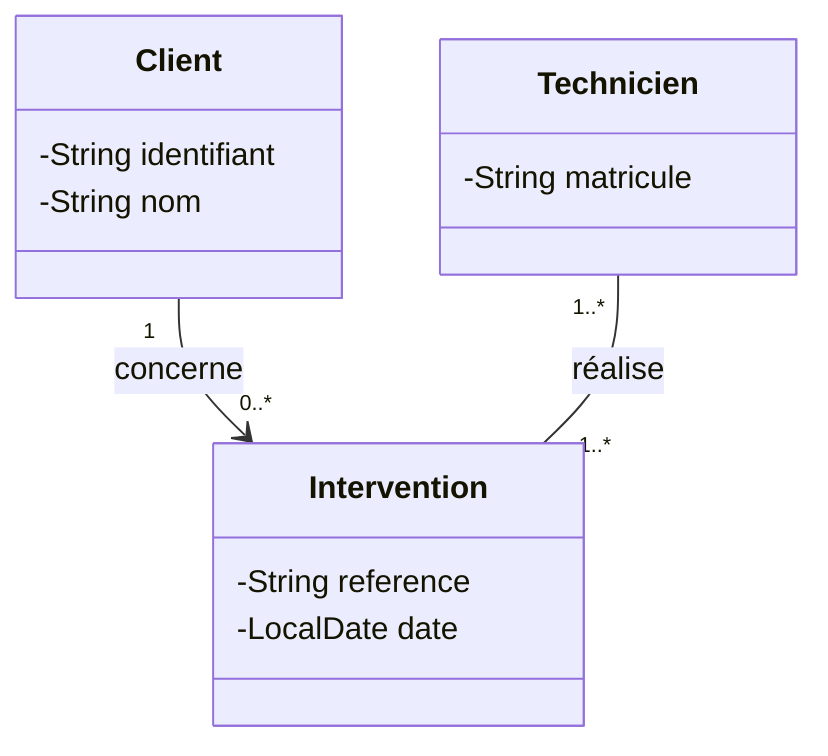
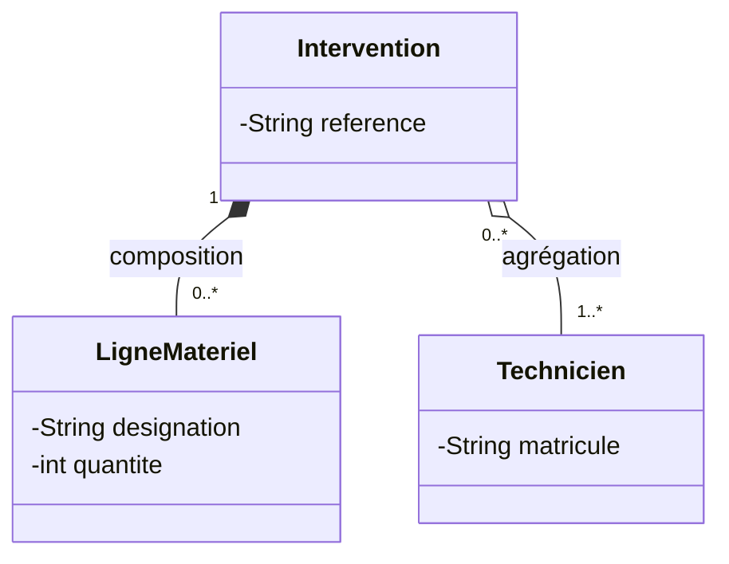
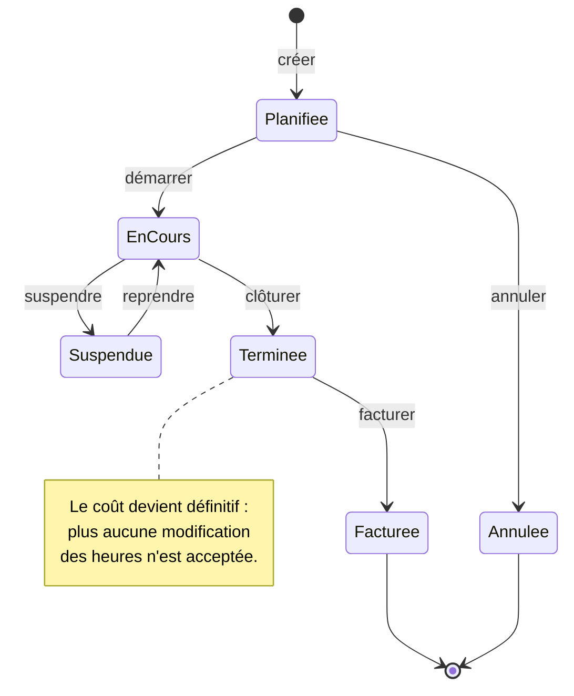
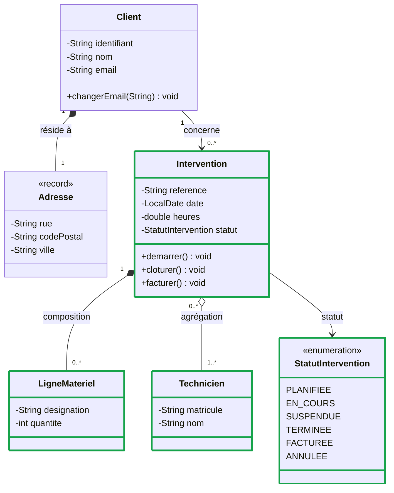

# Associations & cycle de vie

::: info 🎯 Séance 27 · 2 h
À la fin de cette séance, vous savez :

- exprimer une association avec sa multiplicité, et la traduire mécaniquement en Java ;
- distinguer composition et agrégation, et justifier votre choix ;
- décrire le cycle de vie d'un objet par un diagramme d'états ;
- transformer chaque transition en méthode métier qui vérifie son état de départ.

**Socle :** les sections marquées 🚀 sont **hors socle** — voir [socle et approfondissement](/introduction/parcours).

**Prérequis :** [Modéliser le domaine en objets](/api-java/modeliser-poo)

**Livrable attendu :** les associations du domaine et un cycle de vie d'intervention codé sans `setStatut`
:::

Une classe seule ne fait pas un domaine. Cette séance traite les deux dimensions qui relient et animent les objets : **comment ils se rattachent** les uns aux autres, et **comment ils évoluent** dans le temps.

## Les multiplicités

Une association relie deux classes. La **multiplicité** indique combien d'objets participent — c'est l'information la plus dense du diagramme.



| Notation | Lecture |
| --- | --- |
| `1` | Exactement un |
| `0..1` | Zéro ou un — donc **facultatif** |
| `0..*` ou `*` | Zéro ou plusieurs |
| `1..*` | Au moins un |
| `2..5` | Entre deux et cinq |

Lire ce diagramme : *un client est concerné par zéro à plusieurs interventions ; une intervention concerne exactement un client*. Et : *une intervention est réalisée par au moins un technicien ; un technicien réalise au moins une intervention*.

::: warning La multiplicité est une règle de gestion
Écrire `1` plutôt que `0..1` a des conséquences directes : le champ ne peut pas être `null`, le constructeur doit l'exiger, et la base impose un `NOT NULL`. Ce n'est pas un détail de dessin — c'est une contrainte que le code devra faire respecter. Discutez-la avec le client **avant** de coder.
:::

### De la multiplicité au code

La traduction est mécanique — c'est ce qui rend le diagramme utile plutôt que décoratif :

| Multiplicité | Traduction Java |
| --- | --- |
| `1` | Un champ, contrôlé non `null` au constructeur |
| `0..1` | Un champ, ou mieux un `Optional` en retour |
| `0..*` | Une `List` ou un `Set`, initialisée vide |
| `1..*` | Une collection, contrôlée non vide |

```java
public class Intervention {
    private final Client client;        // multiplicité 1 → obligatoire, jamais null

    protected Intervention(String reference, Client client, ...) {
        this.client = Objects.requireNonNull(client, "client requis");
    }
}
```

```java
public class Client {
    private final List<Intervention> interventions = new ArrayList<>();   // 0..*

    public List<Intervention> interventions() {
        return List.copyOf(interventions);      // copie défensive : personne ne modifie la liste
    }
}
```

La copie défensive prolonge l'encapsulation de la séance précédente : renvoyer directement la liste interne laisserait n'importe quel appelant y ajouter un élément sans passer par vos règles.

## Composition et agrégation

Deux façons de dire « contient », avec une différence de **cycle de vie**.



| Notation | Nom | Cycle de vie | Exemple |
| --- | --- | --- | --- |
| `*--` losange plein | **Composition** | La partie **meurt** avec le tout | Les lignes de matériel d'une intervention |
| `o--` losange creux | **Agrégation** | La partie **survit** au tout | Les techniciens affectés |

Le test décisif : *si je supprime l'intervention, que devient l'autre objet ?* Les lignes de matériel n'ont plus de sens seules — c'est une composition. Le technicien, lui, continue d'exister et part sur une autre intervention — c'est une agrégation.

### La différence se voit dans le code

La distinction se traduit par **qui crée l'objet** :

```java
// Composition : l'intervention fabrique ses lignes et ne les expose jamais telles quelles
public void ajouterMateriel(String designation, int quantite) {
    lignes.add(new LigneMateriel(designation, quantite));
}
```

```java
// Agrégation : le technicien existe déjà, il est simplement rattaché
public void affecter(Technicien technicien) {
    techniciens.add(Objects.requireNonNull(technicien));
}
```

C'est la même idée que l'injection de dépendance que vous verrez à la séance suivante : ce qu'on **reçoit** de l'extérieur a sa vie propre, ce qu'on **construit** soi-même nous appartient.

## Le cycle de vie : le diagramme d'états

Le diagramme de classes montre une photographie. Le **diagramme d'états** montre le film d'un seul objet : les états qu'il peut prendre et les événements qui le font passer de l'un à l'autre.



Ce diagramme énonce des règles qu'aucune autre vue ne rend visibles :

- on ne peut **pas** facturer une intervention non terminée ;
- une intervention annulée est un état **final** — on n'en revient pas ;
- « suspendre » n'est possible que depuis « en cours ».

## Du diagramme d'états au code

C'est ici que le modèle devient directement du Java. Chaque **flèche** du diagramme est une **méthode métier** qui vérifie son état de départ :

```java
public enum StatutIntervention { PLANIFIEE, EN_COURS, SUSPENDUE, TERMINEE, FACTUREE, ANNULEE }
```

```java
public class Intervention {

    private StatutIntervention statut = StatutIntervention.PLANIFIEE;

    public void demarrer() {
        exigerStatut(StatutIntervention.PLANIFIEE);
        statut = StatutIntervention.EN_COURS;
    }

    public void suspendre() {
        exigerStatut(StatutIntervention.EN_COURS);
        statut = StatutIntervention.SUSPENDUE;
    }

    public void cloturer() {
        exigerStatut(StatutIntervention.EN_COURS);
        statut = StatutIntervention.TERMINEE;
    }

    public void facturer() {
        exigerStatut(StatutIntervention.TERMINEE);
        statut = StatutIntervention.FACTUREE;
    }

    private void exigerStatut(StatutIntervention attendu) {
        if (statut != attendu) {
            throw new IllegalStateException(
                    "opération impossible depuis le statut " + statut + " (attendu : " + attendu + ")");
        }
    }

    public StatutIntervention statut() { return statut; }
}
```

::: danger Le `setStatut` public est l'erreur à ne pas commettre
```java
intervention.setStatut(StatutIntervention.FACTUREE);   // ❌ saute tout le cycle
```
Un `setStatut` public laisse n'importe quel appelant passer de « planifiée » à « facturée » sans avoir jamais réalisé l'intervention. Le diagramme d'états **est** la liste des transitions autorisées : chacune mérite sa méthode, qui vérifie d'où l'on part. Toutes les autres sont interdites — et le code doit les refuser, pas seulement s'abstenir de les proposer.
:::

## 🚀 Approfondissement — Tester les transitions

*Hors socle : cette section n'est pas exigible de tous. Elle se traite en autonomie, ou avec les étudiants qui avancent vite.*

Le diagramme fournit directement la liste des tests : une transition autorisée, une transition interdite.

```java
class CycleVieInterventionTest {

    private Intervention nouvelle() {
        return new Depannage("I1", new Client("C1", "Dupont", "d@ex.fr"), LocalDate.now(), 2);
    }

    @Test
    void deroule_le_cycle_nominal() {
        var i = nouvelle();
        i.demarrer();
        i.cloturer();
        i.facturer();
        assertEquals(StatutIntervention.FACTUREE, i.statut());
    }

    @Test
    void refuse_de_facturer_une_intervention_non_terminee() {
        var i = nouvelle();
        i.demarrer();                       // EN_COURS, pas TERMINEE
        assertThrows(IllegalStateException.class, i::facturer);
    }

    @Test
    void refuse_de_reprendre_une_intervention_jamais_suspendue() {
        var i = nouvelle();
        assertThrows(IllegalStateException.class, i::reprendre);
    }
}
```

::: tip Un diagramme d'états est un plan de test
Comptez les flèches : chacune donne un test « ça marche ». Comptez les couples (état, événement) **absents** du diagramme : chacun donne un test « c'est refusé ». Le modèle vous dit exactement ce qu'il reste à couvrir — utile quand le seuil JaCoCo de la [séance 30](/api-java/tester-api) devra être atteint.
:::

## Où en est le modèle

Le domaine prend forme : les objets se relient, et l'intervention acquiert un cycle de vie.

| Élément | Nature | Décision qu'il porte |
| --- | --- | --- |
| `Intervention` | classe | L'entité centrale du métier |
| `StatutIntervention` | `<<enumeration>>` | Les états possibles, et eux seuls |
| `LigneMateriel` | classe | Composition : meurt avec son intervention |
| `Technicien` | classe | Agrégation : survit à l'intervention |
| `Client 1 --> 0..* Intervention` | association | Un client sans intervention reste valide |



Remarquez ce que le diagramme rend visible d'un coup d'œil : **le losange plein** vers `LigneMateriel` et **le losange creux** vers `Technicien`. Deux symboles, deux règles de suppression opposées — et une conversation possible avec le client sans lui montrer une ligne de code.

---

## Auto-évaluation

Répondez de mémoire avant de déplier la correction.

::: details 1. Composition ou agrégation entre une commande et ses lignes de commande ?
**Composition** (`*--`). Une ligne de commande n'a aucune existence en dehors de sa commande : si la commande est supprimée, ses lignes disparaissent. Le test est toujours le même — que devient la partie si le tout disparaît ? Si elle survit et peut être rattachée ailleurs, c'est une agrégation.
:::

::: details 2. Que révèle une multiplicité `0..1` sur une association que le client dit obligatoire ?
Une contradiction à lever avant de coder. `0..1` autorise l'absence : le champ pourra être `null`, le code devra traiter ce cas et la base l'acceptera. Si la donnée est toujours présente, la multiplicité doit être `1` — et le constructeur devra refuser `null`. C'est le genre d'ambiguïté que le diagramme fait remonter, et que le code seul laisserait passer.
:::

::: details 3. Pourquoi renvoyer `List.copyOf(interventions)` plutôt que la liste elle-même ?
Parce que renvoyer la liste interne rend l'encapsulation illusoire : l'appelant peut y ajouter ou en retirer des éléments sans passer par aucune de vos règles. La copie défensive garantit que toute modification passe par une méthode de la classe — le même raisonnement que pour les attributs privés, appliqué aux collections.
:::

::: details 4. Combien de tests le diagramme d'états de cette page suggère-t-il ?
Huit transitions autorisées, donc au moins huit tests « ça marche ». Et autant de tests « c'est refusé » que de couples (état, événement) absents du diagramme — facturer depuis « planifiée », reprendre depuis « terminée », démarrer une intervention annulée… Le diagramme énumère à la fois ce qui doit fonctionner et ce qui doit échouer.
:::

**Critères de réussite de la séance**

- ☐ chaque association porte une multiplicité aux deux extrémités
- ☐ composition et agrégation sont employées à bon escient, et justifiables
- ☐ aucune méthode `setStatut` publique n'existe
- ☐ au moins un test vérifie qu'une transition interdite lève une exception

Passons à l'organisation du comportement : [Abstraction & polymorphisme](/api-java/abstraction-polymorphisme).
