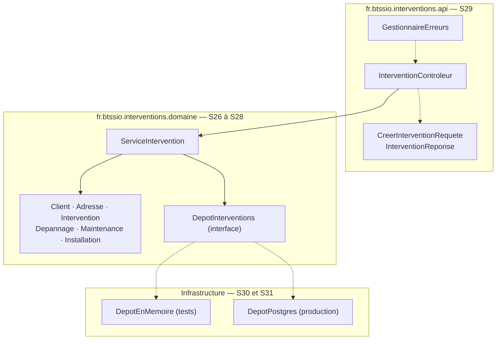

# Une API objet en Java

::: info 🎯 Séance 25 · 2 h
À la fin de cette séance, vous savez :

- justifier le choix de Java pour un projet orienté objet livré en continu ;
- créer un projet Maven et le faire tourner dans un Codespace, sans JDK local ;
- exploiter VS Code pour Java : exécution, débogage, navigation ;
- faire construire ce projet par une CI dès le premier commit.

**Prérequis :** [Dev Containers](/codespaces/dev-containers) et [Modéliser avec UML](/uml/)

**Livrable attendu :** un projet Maven qui se compile dans un Codespace **et** dans la CI
:::

Les six séances qui suivent construisent une **API REST** de gestion d'interventions informatiques. L'objectif est double : manipuler pour de bon les concepts de la **programmation orientée objet**, et faire passer ce code applicatif dans toute la chaîne DevOps déjà montée — CI, tests, couverture, image conteneur, déploiement.

## Ce que vous allez construire

Avant d'écrire une ligne, voici la carte. Chaque paquetage sera bâti dans une séance, et le **diagramme de classes du domaine s'enrichira à chaque fois** — vous le retrouverez en fin de chaque page, sous le titre « Où en est le modèle ».



Le sens des flèches est la seule chose à retenir pour l'instant : **tout pointe vers le domaine, le domaine ne pointe vers rien**. Ni le web, ni la base de données n'entrent dans le métier. C'est ce qui rendra l'application testable, et c'est la propriété que les six séances suivantes vont construire pas à pas.

## Pourquoi Java plutôt que TypeScript

Les deux langages permettent d'écrire une API. Pour un cours dont l'objectif affiché est la **POO**, Java l'emporte sur quatre points :

| Critère | Java | TypeScript |
| --- | --- | --- |
| **Objet** | Classes, interfaces, héritage et abstraction sont le modèle **obligatoire** | Classes disponibles, mais le style fonctionnel domine en pratique |
| **Typage** | Vérifié à la compilation **et** présent à l'exécution | Effacé à la compilation : une interface n'existe plus à l'exécution |
| **Encapsulation** | `private` réellement appliqué par la JVM | `private` est une convention retirée à la compilation |
| **Outillage qualité** | JUnit, Mockito, JaCoCo, Checkstyle : standards stables et universels | Écosystème riche mais mouvant |

Le point décisif est le troisième. En TypeScript, écrire `private solde: number` n'empêche personne d'écrire `compte['solde'] = 1_000_000` à l'exécution : l'encapsulation est une politesse. En Java, c'est une garantie. Difficile d'enseigner sérieusement l'encapsulation dans un langage qui ne l'applique pas.

::: tip Ce qui reste vrai quel que soit le langage
Tout ce que vous avez appris sur la CI, la couverture et la livraison **ne change pas** avec le langage. Seules changent les commandes : `mvn test` au lieu de `npm test`, JaCoCo au lieu de v8. C'est précisément la leçon — un pipeline raisonne en étapes, pas en syntaxe.
:::

## Les versions retenues

| Outil | Version | Pourquoi |
| --- | --- | --- |
| **Java** | **21 LTS** | Support jusqu'en 2029, documentation abondante, disponible partout |
| **Spring Boot** | **4.1** | Ligne open source maintenue jusqu'en juillet 2027 |
| **Maven** | 3.9+ | Standard de fait, intégré à VS Code |

Java 25 LTS existe depuis septembre 2025 et Spring Boot 4.1 l'accepte également. On reste sur **21** parce que c'est la version que vous trouverez installée en entreprise et documentée dans la quasi-totalité des ressources en ligne. Vous testerez les deux dans la CI grâce à une [matrice](/actions/matrices-artefacts) — l'occasion de réemployer la notion sur un cas réel.

## Préparer le Codespace

Ajoutez Java à votre [Dev Container](/codespaces/dev-containers) — aucune installation sur votre poste :

```json
{
  "name": "API interventions",
  "image": "mcr.microsoft.com/devcontainers/java:21",
  "features": {
    "ghcr.io/devcontainers/features/java:1": {
      "version": "21",
      "installMaven": true
    }
  },
  "customizations": {
    "vscode": {
      "extensions": [
        "vscjava.vscode-java-pack",
        "vmware.vscode-boot-dev-pack"
      ]
    }
  },
  "postCreateCommand": "mvn -q dependency:go-offline"
}
```

Après un **Rebuild Container**, vérifiez :

```bash
java -version      # openjdk 21...
mvn -version       # Apache Maven 3.9...
```

## Créer le projet

```bash
mvn archetype:generate \
  -DgroupId=fr.btssio.interventions \
  -DartifactId=api-interventions \
  -DarchetypeArtifactId=maven-archetype-quickstart \
  -DinteractiveMode=false
```

L'arborescence produite est une convention que tout outil Java comprend :

```
api-interventions/
├── pom.xml                      ← dépendances et configuration du build
└── src/
    ├── main/java/…              ← le code de production
    └── test/java/…              ← les tests, jamais livrés
```

::: tip La séparation `main` / `test`
Elle n'est pas cosmétique : Maven compile les deux, mais n'embarque que `main` dans le livrable. Vos tests et vos bibliothèques de test ne partent jamais en production — une propriété que le monde npm obtient plus laborieusement avec `devDependencies`.
:::

## Un premier code exécutable

`src/main/java/fr/btssio/interventions/Application.java` :

```java
package fr.btssio.interventions;

public class Application {
    public static void main(String[] args) {
        System.out.println("API interventions — démarrage");
    }
}
```

```bash
mvn compile
mvn exec:java -Dexec.mainClass=fr.btssio.interventions.Application
```

Dans VS Code, un bouton **Run** apparaît directement au-dessus de `main` : c'est le chemin que vous emprunterez au quotidien. Le point d'arrêt posé dans la marge fonctionne de la même façon — dans le navigateur, sur une machine distante.

## La CI dès le premier jour

`.github/workflows/ci-java.yml` :

```yaml
name: CI Java

on:
  push:
    branches: [main]
  pull_request:

permissions:
  contents: read

jobs:
  build:
    runs-on: ubuntu-latest
    strategy:
      matrix:
        java: ['21', '25']       # LTS courante et LTS suivante
    steps:
      - uses: actions/checkout@v4

      - name: Installer Java ${{ matrix.java }}
        uses: actions/setup-java@v4
        with:
          distribution: 'temurin'
          java-version: ${{ matrix.java }}
          cache: 'maven'

      - name: Construire et tester
        run: mvn -B verify
```

Trois détails valent d'être notés :

- **`cache: 'maven'`** met en cache `~/.m2`. Sans lui, chaque exécution retélécharge toutes les dépendances.
- **`-B`** (*batch mode*) supprime les barres de progression, illisibles dans des journaux de CI.
- **`verify`** enchaîne compilation, tests et vérifications. C'est la phase à utiliser en CI, pas `mvn test` qui s'arrête plus tôt.

Mettre la CI en place **avant** d'écrire le code applicatif n'est pas un détail d'ordre : c'est ce qui garantit qu'elle ne sera jamais « ajoutée plus tard ».

---

## Auto-évaluation

Répondez de mémoire avant de déplier la correction.

::: details 1. Pourquoi l'encapsulation est-elle plus solide en Java qu'en TypeScript ?
Parce que `private` en Java est appliqué par la JVM : l'accès depuis l'extérieur ne compile pas, et le contournement demande de la réflexion explicite. En TypeScript, `private` disparaît à la compilation — le JavaScript produit expose le champ, et `objet['champ']` y accède sans obstacle. L'un est une garantie, l'autre une convention.
:::

::: details 2. Que fait `mvn verify` de plus que `mvn test` ?
Le cycle Maven est ordonné : `compile` → `test` → `package` → `verify`. `test` s'arrête après les tests unitaires ; `verify` va jusqu'à l'empaquetage, les tests d'intégration et les contrôles de qualité branchés sur le build — dont la vérification de couverture. En CI, c'est `verify` qu'on veut.
:::

::: details 3. Pourquoi tester sur deux versions de Java alors qu'une seule sera déployée ?
Pour découvrir une incompatibilité **avant** d'y être contraint. Le jour où l'hébergeur imposera une montée de version, vous saurez déjà si le code passe. C'est le même raisonnement que pour Dependabot : anticiper une migration coûte quelques minutes de CI, la subir coûte un incident.
:::

**Critères de réussite de la séance**

- ☐ `mvn -version` répond dans le Codespace, sans rien installer localement
- ☐ le projet se compile et s'exécute depuis VS Code
- ☐ la CI est verte sur les deux versions de Java
- ☐ je sais expliquer ce que contient `src/main` et ce que contient `src/test`

Passons à la modélisation : [Modéliser le domaine en objets](/api-java/modeliser-poo).
