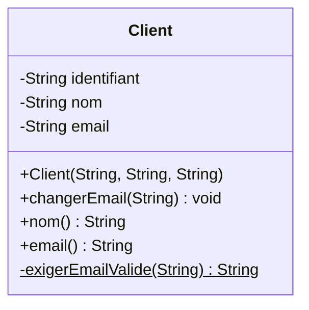
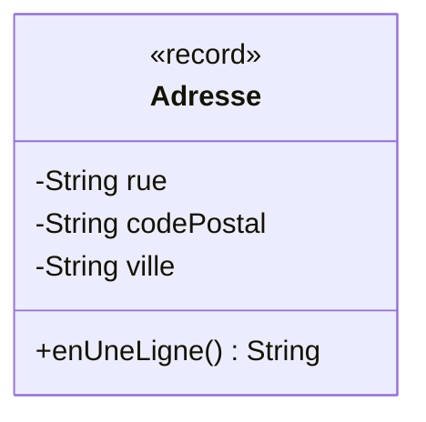
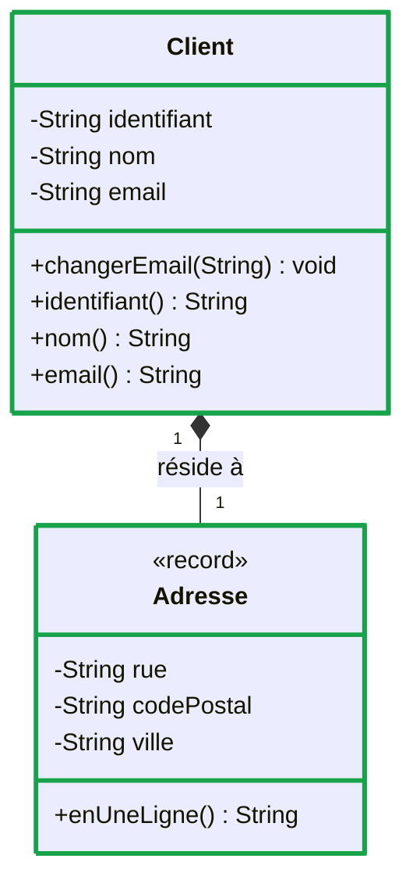

# Modéliser le domaine en objets

::: info 🎯 Séance 26 · 2 h
À la fin de cette séance, vous savez :

- lire et écrire la notation UML d'une classe : compartiments, visibilité, opérations ;
- écrire une classe qui protège son état par l'encapsulation ;
- garantir qu'un objet ne peut pas exister dans un état incohérent ;
- choisir entre une classe mutable et un `record` immuable, et le noter au diagramme.

**Prérequis :** [Une API objet en Java](/api-java/) et [Modéliser avec UML](/uml/)

**Livrable attendu :** le diagramme de classes du domaine **et** les classes correspondantes, avec leurs tests
:::

Avant toute API, il faut un **domaine** : les objets qui représentent le métier. Cette séance ne contient volontairement aucune ligne de Spring. Une bonne conception objet ne dépend d'aucun framework — et c'est justement ce qui la rend durable.

Le métier retenu : une entreprise de services informatiques suit des **interventions** chez ses clients.

Chaque notion de POO est présentée avec **sa notation UML** : le diagramme n'est pas une illustration ajoutée après coup, c'est la façon dont on énonce la décision avant de l'écrire en Java.

## La notation UML d'une classe

Une classe se dessine en trois compartiments : le nom, les attributs, les opérations.



### La visibilité

| Symbole | Portée | Java |
| --- | --- | --- |
| `+` | Public — accessible de partout | `public` |
| `-` | Privé — la classe seule | `private` |
| `#` | Protégé — la classe et ses sous-classes | `protected` |
| `~` | Paquetage | (défaut) |

Ce petit tableau porte l'essentiel de la séance. Un diagramme où **tous les attributs sont `+`** signale une conception qui a oublié l'encapsulation : on le voit d'un coup d'œil, avant même d'ouvrir le code. Les attributs se notent `-`, les opérations qui forment le contrat public se notent `+`.

::: tip Le soulignement
Un membre **souligné** est `static` : il appartient à la classe, pas aux instances. En Mermaid, on l'écrit avec un `$` final — ci-dessus, `exigerEmailValide` est une méthode de validation partagée, privée et statique.
:::

## L'encapsulation : protéger l'état

Voici ce que le diagramme précédent interdit d'écrire :

```java
public class Client {
    public String nom;        // ← n'importe qui peut tout écrire
    public String email;
}
```

```java
client.email = "";            // rien ne l'interdit
client.nom = null;            // l'objet devient incohérent
```

La version conforme au diagramme :

```java
package fr.btssio.interventions.domaine;

import java.util.Objects;

public class Client {

    private final String identifiant;
    private String nom;
    private String email;

    public Client(String identifiant, String nom, String email) {
        this.identifiant = Objects.requireNonNull(identifiant, "identifiant requis");
        this.nom = exigerNomValide(nom);
        this.email = exigerEmailValide(email);
    }

    public void changerEmail(String nouvelEmail) {
        this.email = exigerEmailValide(nouvelEmail);
    }

    public String identifiant() { return identifiant; }
    public String nom()         { return nom; }
    public String email()       { return email; }

    private static String exigerNomValide(String nom) {
        if (nom == null || nom.isBlank()) {
            throw new IllegalArgumentException("le nom ne peut pas être vide");
        }
        return nom.strip();
    }

    private static String exigerEmailValide(String email) {
        if (email == null || !email.contains("@")) {
            throw new IllegalArgumentException("email invalide : " + email);
        }
        return email.toLowerCase();
    }
}
```

Quatre décisions à relever, toutes lisibles sur le diagramme :

- **`private`** (`-` au diagramme) — l'état n'est accessible que par le code de la classe.
- **`final` sur `identifiant`** — une identité ne change jamais après création.
- **La validation est dans le constructeur** — il devient impossible d'obtenir un `Client` invalide.
- **`changerEmail` plutôt que `setEmail`** — le nom décrit une intention métier, et la validation est rejouée à chaque modification.

::: tip Le vrai rôle de l'encapsulation
Ce n'est pas « cacher les variables ». C'est **garantir un invariant** : une propriété toujours vraie pour tout objet de la classe. Ici, tout `Client` a un nom non vide et un email contenant `@`. Aucun appelant, présent ou futur, ne peut casser cette règle — et vous n'aurez jamais à la vérifier ailleurs dans le code.
:::

## Le constructeur comme gardien

C'est le point le plus souvent manqué. Comparez deux façons d'obtenir la même sécurité :

```java
// ❌ Validation dispersée : chaque appelant doit y penser
if (nom != null && !nom.isBlank()) {
    client.nom = nom;
}
```

```java
// ✅ Validation centralisée : personne ne peut l'oublier
Client client = new Client("C1", nom, email);   // lève si invalide
```

Dans le premier cas, la règle est répétée partout et sera oubliée un jour. Dans le second, elle existe à un seul endroit et le compilateur force à passer par lui. C'est ce qu'on appelle rendre les **états invalides irreprésentables**.

## Les `record` : objets immuables

Quand un objet ne fait que **porter des données** sans changer, Java offre une écriture condensée. En UML, on le signale par un **stéréotype** :



Le stéréotype `<<record>>` — entre doubles chevrons — précise la **nature** de l'élément. Vous rencontrerez de la même façon `<<interface>>`, `<<abstract>>` ou `<<enumeration>>`.

```java
public record Adresse(String rue, String codePostal, String ville) {

    public Adresse {                              // constructeur compact
        Objects.requireNonNull(rue, "rue requise");
        if (!codePostal.matches("\\d{5}")) {
            throw new IllegalArgumentException("code postal invalide : " + codePostal);
        }
    }

    public String enUneLigne() {
        return "%s, %s %s".formatted(rue, codePostal, ville);
    }
}
```

Cette déclaration engendre automatiquement le constructeur, les accesseurs, `equals`, `hashCode` et `toString`. Les champs sont `final` : l'objet est **immuable**.

| Choisir une classe si… | Choisir un `record` si… |
| --- | --- |
| L'objet a une identité durable (`Client`) | L'objet est défini par ses valeurs (`Adresse`) |
| Son état évolue | Il ne change jamais après création |
| Il porte du comportement métier | Il transporte surtout des données |

::: warning L'immuabilité n'est pas une coquetterie
Un objet immuable est **partageable sans risque** : aucun appel ne peut le modifier dans votre dos, et il est sûr en contexte concurrent. Dans une API qui traite plusieurs requêtes simultanées, c'est une propriété qui évite une catégorie entière de bugs — les plus difficiles à reproduire.
:::

## `equals`, `hashCode`, `toString`

Par défaut, deux objets Java ne sont égaux que s'ils occupent la **même case mémoire** :

```java
var a = new Client("C1", "Dupont", "d@ex.fr");
var b = new Client("C1", "Dupont", "d@ex.fr");
a.equals(b);        // false !
```

Pour une entité, l'égalité doit porter sur l'**identité métier** :

```java
    @Override
    public boolean equals(Object autre) {
        if (this == autre) return true;
        if (!(autre instanceof Client client)) return false;
        return identifiant.equals(client.identifiant);
    }

    @Override
    public int hashCode() {
        return identifiant.hashCode();
    }

    @Override
    public String toString() {
        return "Client[%s, %s]".formatted(identifiant, nom);
    }
```

::: danger Le contrat equals / hashCode
Si `a.equals(b)` est vrai, alors `a.hashCode() == b.hashCode()` **doit** l'être aussi. Rompre ce contrat produit des bugs redoutables : un objet rangé dans un `HashMap` devient introuvable, un `Set` accepte deux fois le même élément. Redéfinissez toujours les deux ensemble — ou utilisez un `record`, qui s'en charge.
:::

## Ce qu'on ne met pas dans un diagramme de classes

Un diagramme exhaustif est illisible et faux au bout d'une semaine. Trois règles :

- **Une vue = une question.** Un diagramme pour le domaine, un autre pour l'architecture en couches. Pas un seul pour tout.
- **Pas de getters/setters.** Ils encombrent sans rien apprendre. On ne montre que les opérations qui portent du sens métier — `changerEmail` oui, `getNom` non.
- **Pas les classes techniques.** Les DTO, les contrôleurs et les classes utilitaires n'ont rien à faire dans un diagramme de **domaine**.

## Tester le domaine

Ces classes ne dépendent de rien : leurs tests sont instantanés.

```java
package fr.btssio.interventions.domaine;

import org.junit.jupiter.api.Test;
import static org.junit.jupiter.api.Assertions.*;

class ClientTest {

    @Test
    void refuse_un_nom_vide() {
        var erreur = assertThrows(IllegalArgumentException.class,
                () -> new Client("C1", "   ", "d@ex.fr"));
        assertEquals("le nom ne peut pas être vide", erreur.getMessage());
    }

    @Test
    void normalise_l_email_en_minuscules() {
        var client = new Client("C1", "Dupont", "Dupont@Example.FR");
        assertEquals("dupont@example.fr", client.email());
    }

    @Test
    void deux_clients_de_meme_identifiant_sont_egaux() {
        assertEquals(new Client("C1", "Dupont", "a@ex.fr"),
                     new Client("C1", "Martin", "b@ex.fr"));
    }
}
```

Remarquez le troisième test : deux clients aux noms différents sont **égaux** parce qu'ils partagent le même identifiant. C'est un choix de conception, et le test le documente aussi bien qu'un commentaire — mieux, même, puisqu'il échouera si quelqu'un le contredit.

Ajoutez la dépendance dans `pom.xml` :

```xml
<dependency>
  <groupId>org.junit.jupiter</groupId>
  <artifactId>junit-jupiter</artifactId>
  <version>5.11.4</version>
  <scope>test</scope>
</dependency>
```

Le `<scope>test</scope>` garantit que JUnit ne partira jamais en production.

## Où en est le modèle

Le domaine démarre. Deux classes, et déjà trois décisions de conception inscrites au diagramme.

| Élément | Nature | Décision qu'il porte |
| --- | --- | --- |
| `Client` | classe | Entité : identité durable, état modifiable de façon contrôlée |
| `Adresse` | `<<record>>` | Valeur : immuable, définie par son contenu |
| `Client *-- Adresse` | composition | L'adresse n'existe pas sans son client |



Les éléments **à bord vert épais** sont ceux introduits par la séance. À chaque séance, ce diagramme s'enrichira sans jamais être redessiné de zéro — c'est ainsi qu'un modèle vit dans un vrai projet : il **évolue en même temps que le code**, dans le même commit.

---

## Auto-évaluation

Répondez de mémoire avant de déplier la correction.

::: details 1. Que révèle un diagramme de classes dont tous les attributs sont notés `+` ?
Que l'encapsulation a été oubliée : l'état interne est modifiable de l'extérieur sans passer par aucune validation. C'est un défaut de conception repérable **avant** de lire une ligne de code — l'un des intérêts concrets du diagramme en revue. Les attributs se notent `-`, seules les opérations du contrat public se notent `+`.
:::

::: details 2. Pourquoi valider dans le constructeur plutôt que dans un `setNom` ?
Parce que le constructeur est le **seul** passage obligé pour créer l'objet. Valider ailleurs laisse toujours un chemin où la règle est oubliée. En validant à la construction, un objet invalide ne peut littéralement pas exister — et le reste du code n'a plus jamais à s'en soucier.
:::

::: details 3. Classe ou `record` pour représenter une intervention qui change de statut ?
Une **classe**. Un `record` est immuable : changer le statut imposerait de recréer l'objet entier, ce qui n'a pas de sens pour une entité qui vit dans le temps et possède une identité. Le `record` convient pour les valeurs — une adresse, un montant, un DTO de réponse — et se note `<<record>>` au diagramme.
:::

::: details 4. Que se passe-t-il si l'on redéfinit `equals` sans `hashCode` ?
Deux objets peuvent être « égaux » tout en ayant des empreintes différentes. Rangés dans un `HashMap` ou un `HashSet`, ils atterrissent dans des compartiments distincts : on ne retrouve plus un objet qu'on vient d'insérer, et un `Set` contient deux exemplaires de la même chose. Le bug est silencieux et très pénible à diagnostiquer.
:::

**Critères de réussite de la séance**

- ☐ aucun attribut n'est `public`, ni dans le code ni sur le diagramme
- ☐ chaque validation métier vit dans le constructeur
- ☐ le diagramme ne contient ni getter, ni setter, ni classe technique
- ☐ `equals` et `hashCode` sont redéfinis ensemble, ou remplacés par un `record`

Relions maintenant ces objets entre eux : [Associations & cycle de vie](/api-java/associations-cycle-vie).
