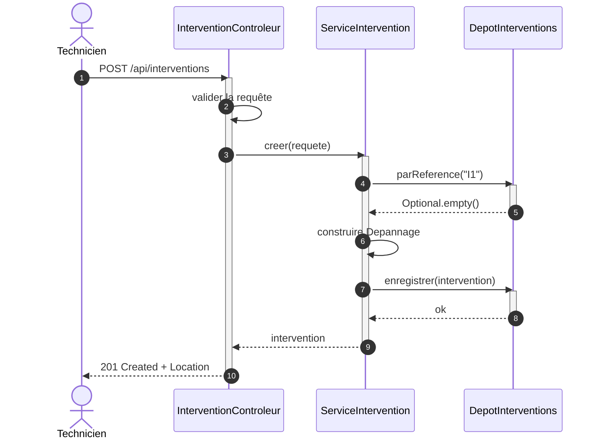
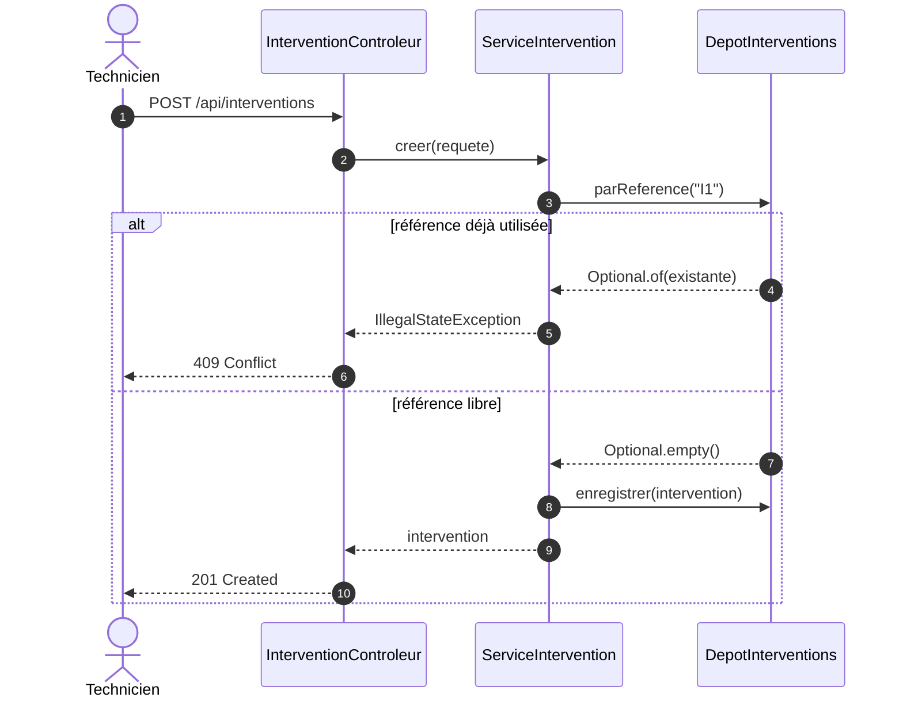

# Tester l'API

::: info 🎯 Séance 30 · 2 h
À la fin de cette séance, vous savez :

- lire et écrire un diagramme de séquence, et en déduire les tests à écrire ;
- appliquer la pyramide des tests à un projet Java réel ;
- simuler une dépendance avec Mockito, et savoir quand s'en abstenir ;
- mesurer la couverture avec JaCoCo et la rendre bloquante.

**Prérequis :** [Exposer une API REST](/api-java/api-rest) et [Couverture de code](/qualite/couverture)

**Livrable attendu :** un diagramme de séquence, les tests qui en découlent, et un seuil JaCoCo qui fait échouer `mvn verify`
:::

C'est ici que les trois fils du cours se rejoignent : les concepts de test de la [séance 20](/qualite/), le code écrit depuis la séance 25, et la modélisation — car **le diagramme de séquence est un plan de test**.

## Le diagramme de séquence

Il décrit **qui appelle qui, dans quel ordre**, pour un scénario précis. C'est le diagramme de la conception détaillée, celui qu'on dessine au tableau pendant une revue.



Les éléments à connaître :

| Élément | Notation | Sens |
| --- | --- | --- |
| **Ligne de vie** | trait vertical | La durée d'existence du participant |
| **Barre d'activation** | rectangle sur la ligne | Le participant exécute quelque chose |
| **Message synchrone** | flèche pleine `->>` | Appel : l'émetteur attend la réponse |
| **Retour** | flèche pointillée `-->>` | Réponse |
| **Auto-appel** | flèche vers soi-même | Traitement interne |

Ce diagramme dit en une image ce que le code disperse sur quatre fichiers : le contrôleur **valide** puis délègue, le service **vérifie l'unicité avant d'écrire**, et le `201` n'est renvoyé qu'après l'enregistrement effectif.

### Les cas alternatifs

Un scénario nominal ne suffit jamais. Les **fragments combinés** décrivent les branches :



| Fragment | Usage |
| --- | --- |
| `alt` / `else` | Alternative selon une condition |
| `opt` | Traitement optionnel, sans branche inverse |
| `loop` | Répétition |
| `par` | Traitements parallèles |

::: tip Chaque branche `alt` est un test à écrire
C'est le lien à retenir de cette séance. Le diagramme ci-dessus annonce **deux** tests : `201` quand la référence est libre, `409` quand elle est prise. Vous allez les écrire quelques paragraphes plus bas, à l'identique. Dessiner les alternatives, c'est déjà lister ce qu'il faudra couvrir — et une branche oubliée au diagramme est une branche oubliée en couverture.
:::

## La pyramide, côté Java

| Niveau | Outil | Ce qui est réel | Durée typique |
| --- | --- | --- | --- |
| **Unitaire** | JUnit 5 seul | Le domaine uniquement | ~1 ms |
| **Unitaire avec doublure** | JUnit + Mockito | Le service ; le dépôt est simulé | ~5 ms |
| **Tranche web** | `@WebMvcTest` + MockMvc | Contrôleur, sérialisation, validation | ~200 ms |
| **Intégration** | `@SpringBootTest` | Toute l'application | ~2 s |

L'écart va de 1 ms à 2 s — un facteur 2000. C'est ce qui justifie la forme de la pyramide, en Java comme ailleurs.

## Niveau 1 — Le domaine, sans rien

Le domaine ne dépend d'aucun framework : ses tests sont du JUnit nu.

```java
class DepannageTest {

    private final Client client = new Client("C1", "Dupont", "d@ex.fr");

    @Test
    void applique_le_taux_horaire_et_le_forfait_de_deplacement() {
        var depannage = new Depannage("I1", client, LocalDate.now(), 2);
        assertEquals(230, depannage.cout(), 0.001);      // 90 × 2 + 50
    }

    @ParameterizedTest
    @ValueSource(doubles = {0, -1, -0.5})
    void refuse_une_duree_non_positive(double heures) {
        assertThrows(IllegalArgumentException.class,
                () -> new Depannage("I1", client, LocalDate.now(), heures));
    }
}
```

`@ParameterizedTest` rejoue le même test sur plusieurs valeurs : trois cas limites couverts sans dupliquer une ligne.

::: tip Les cas limites d'abord
`0`, `-1`, la valeur juste sous le seuil, la chaîne vide, `null` : c'est là que se logent les bugs. Le cas nominal, lui, est presque toujours correct — c'est celui que le développeur avait en tête en écrivant le code.
:::

## Niveau 2 — Le service, avec une doublure

Le service dépend de `DepotInterventions`. On peut soit écrire une implémentation en mémoire ([séance 28](/api-java/abstraction-polymorphisme)), soit la simuler avec **Mockito**.

```java
@ExtendWith(MockitoExtension.class)
class ServiceInterventionTest {

    @Mock  private DepotInterventions depot;
    @InjectMocks private ServiceIntervention service;

    private final Client client = new Client("C1", "Dupont", "d@ex.fr");

    @Test
    void additionne_le_cout_des_interventions_du_client() {
        when(depot.parClient("C1")).thenReturn(List.of(
                new Depannage("I1", client, LocalDate.now(), 2),      // 230
                new Maintenance("I2", client, LocalDate.now(), 4)));  // 252

        assertEquals(482, service.chiffreAffairesClient("C1"), 0.001);
    }

    @Test
    void refuse_une_reference_deja_utilisee() {
        var existante = new Depannage("I1", client, LocalDate.now(), 1);
        when(depot.parReference("I1")).thenReturn(Optional.of(existante));

        assertThrows(IllegalStateException.class,
                () -> service.enregistrer(new Maintenance("I1", client, LocalDate.now(), 1)));

        verify(depot, never()).enregistrer(any());     // rien n'a été écrit
    }
}
```

Le `verify(depot, never()).enregistrer(any())` est le plus instructif : il vérifie qu'**aucune écriture n'a eu lieu** en cas de conflit. Sur le diagramme de séquence, cela correspond à la flèche `enregistrer` **absente** de la branche « référence déjà utilisée » — un comportement qu'aucune assertion sur la valeur de retour ne peut prouver.

::: warning Doublure ou implémentation en mémoire ?
Mockito brille pour vérifier des **interactions** (« a-t-on bien appelé, et une seule fois ? »). Pour tester un enchaînement d'opérations, une implémentation en mémoire reste souvent plus lisible qu'une pile de `when(...)`. Un test noyé sous dix lignes de configuration Mockito est le signe qu'il faut changer d'approche — ou que le service en fait trop.
:::

## Niveau 3 — La couche web, sans serveur

`@WebMvcTest` ne charge que la couche HTTP : le contexte démarre en quelques centaines de millisecondes et aucun port n'est ouvert. **Les deux branches `alt` du diagramme deviennent deux tests** :

```java
@WebMvcTest(InterventionControleur.class)
class InterventionControleurTest {

    @Autowired  private MockMvc mvc;
    @MockitoBean private ServiceIntervention service;

    @Test
    void renvoie_200_et_le_cout_calcule() throws Exception {
        var client = new Client("C1", "Dupont", "d@ex.fr");
        when(service.parReference("I1"))
                .thenReturn(new Depannage("I1", client, LocalDate.now(), 2));

        mvc.perform(get("/api/interventions/I1"))
           .andExpect(status().isOk())
           .andExpect(jsonPath("$.reference").value("I1"))
           .andExpect(jsonPath("$.cout").value(230.0))
           .andExpect(jsonPath("$.libelle").value("Dépannage sur site"));
    }

    @Test   // ← branche « référence déjà utilisée » du diagramme
    void renvoie_409_si_la_reference_est_deja_utilisee() throws Exception {
        when(service.creer(any()))
                .thenThrow(new IllegalStateException("référence déjà utilisée : I1"));

        mvc.perform(post("/api/interventions")
                .contentType(MediaType.APPLICATION_JSON)
                .content("""
                    {"reference":"I1","identifiantClient":"C1",
                     "type":"DEPANNAGE","heures":2,"coutMateriel":0}
                    """))
           .andExpect(status().isConflict())
           .andExpect(jsonPath("$.statut").value(409));
    }

    @Test
    void renvoie_404_si_la_reference_est_inconnue() throws Exception {
        when(service.parReference("INCONNUE"))
                .thenThrow(new InterventionIntrouvableException("INCONNUE"));

        mvc.perform(get("/api/interventions/INCONNUE"))
           .andExpect(status().isNotFound());
    }

    @Test
    void renvoie_400_et_designe_le_champ_fautif() throws Exception {
        mvc.perform(post("/api/interventions")
                .contentType(MediaType.APPLICATION_JSON)
                .content("""
                    {"reference":"I2","identifiantClient":"C1",
                     "type":"DEPANNAGE","heures":-5,"coutMateriel":0}
                    """))
           .andExpect(status().isBadRequest())
           .andExpect(jsonPath("$.details.heures").exists());
    }
}
```

Ces tests vérifient ce qu'aucun test unitaire ne peut atteindre : le routage des URL, la désérialisation JSON, le déclenchement de la validation, et la traduction des exceptions par le `@RestControllerAdvice`.

Notez le texte multiligne `"""..."""` : les blocs de texte de Java rendent le JSON lisible sans échappement.

## Mesurer la couverture avec JaCoCo

Dans `pom.xml` :

```xml
<plugin>
  <groupId>org.jacoco</groupId>
  <artifactId>jacoco-maven-plugin</artifactId>
  <version>0.8.12</version>
  <executions>
    <execution>
      <goals><goal>prepare-agent</goal></goals>
    </execution>
    <execution>
      <id>rapport-et-controle</id>
      <phase>verify</phase>
      <goals>
        <goal>report</goal>
        <goal>check</goal>
      </goals>
      <configuration>
        <rules>
          <rule>
            <element>BUNDLE</element>
            <limits>
              <limit>
                <counter>LINE</counter>
                <value>COVEREDRATIO</value>
                <minimum>0.80</minimum>
              </limit>
              <limit>
                <counter>BRANCH</counter>
                <value>COVEREDRATIO</value>
                <minimum>0.75</minimum>
              </limit>
            </limits>
          </rule>
        </rules>
        <excludes>
          <exclude>**/Application.class</exclude>
          <exclude>**/*Requete.class</exclude>
          <exclude>**/*Reponse.class</exclude>
        </excludes>
      </configuration>
    </execution>
  </executions>
</plugin>
```

```bash
mvn verify
```

Le but `check` **fait échouer le build** si les seuils ne sont pas atteints — l'équivalent exact des `thresholds` de Vitest vus en [séance 21](/qualite/couverture). Le rapport navigable est écrit dans `target/site/jacoco/index.html`.

Les exclusions méritent un mot : la classe `Application` ne contient que le `main`, et les DTO ne sont que des porteurs de données engendrés. Les inclure ferait baisser artificiellement le pourcentage sans qu'aucun test utile ne puisse le remonter.

::: tip Deux modèles, deux listes de tests
Si la couverture reste sous le seuil, revenez aux diagrammes plutôt qu'au rapport. Le diagramme de **séquence** énumère les branches d'un scénario ; le diagramme d'**états** de la [séance 27](/api-java/associations-cycle-vie) énumère les transitions autorisées et interdites. Une branche non couverte y figure presque toujours.
:::

## Dans la CI

```yaml
      - name: Construire, tester, vérifier la couverture
        run: mvn -B verify

      - name: Conserver le rapport JaCoCo
        if: always()
        uses: actions/upload-artifact@v4
        with:
          name: jacoco-java-${{ matrix.java }}
          path: target/site/jacoco/
          retention-days: 7
```

Le nom d'artefact inclut la version de Java : sans cela, les deux exécutions de la matrice se disputeraient le même nom et la seconde échouerait.

---

## Auto-évaluation

Répondez de mémoire avant de déplier la correction.

::: details 1. Comment un diagramme de séquence aide-t-il à atteindre un seuil de couverture ?
Chaque fragment `alt` correspond à une branche du code, donc à un test. Un diagramme à trois branches annonce trois tests ; s'il n'y en a que deux d'écrits, la couverture de branches le signalera. Le diagramme sert de liste de contrôle : on compare les chemins dessinés aux chemins testés, et l'écart saute aux yeux.
:::

::: details 2. Que prouve `verify(depot, never()).enregistrer(any())` que les autres assertions ne prouvent pas ?
Qu'aucun **effet de bord** ne s'est produit. Vérifier que la méthode a levé une exception ne dit rien de ce qu'elle a fait avant : elle aurait pu écrire en base puis échouer. Ce `verify` correspond exactement à l'absence de la flèche `enregistrer` dans la branche de conflit du diagramme de séquence.
:::

::: details 3. Pourquoi `@WebMvcTest` plutôt que `@SpringBootTest` pour tester un contrôleur ?
`@SpringBootTest` démarre l'application entière — toutes les couches, la source de données, la configuration — pour vérifier un code de retour HTTP. `@WebMvcTest` ne charge que la couche web et remplace le service par une doublure : dix fois plus rapide, et l'échec désigne le contrôleur plutôt qu'un composant lointain. On réserve `@SpringBootTest` à quelques tests de bout en bout.
:::

::: details 4. Pourquoi exclure les DTO du calcul de couverture ?
Parce qu'un `record` n'est qu'un porteur de données dont le code est engendré par le compilateur. Le tester ne vérifierait rien de votre logique, mais son absence de couverture fait baisser le pourcentage global. On l'exclut pour que l'indicateur reflète le code qui porte des règles — sinon, on est poussé à écrire des tests sans valeur pour faire monter un chiffre.
:::

**Critères de réussite de la séance**

- ☐ le diagramme de séquence comporte au moins un fragment `alt`
- ☐ chaque branche `alt` correspond à un test écrit
- ☐ les tests du domaine ne chargent aucun contexte Spring
- ☐ un test vérifie qu'aucune écriture n'a lieu en cas de conflit
- ☐ `mvn verify` échoue si la couverture de branches passe sous 75 %

Livrons maintenant cette API : [TP 5 — Livrer l'API par le pipeline](/tp/tp5-api-livree).
