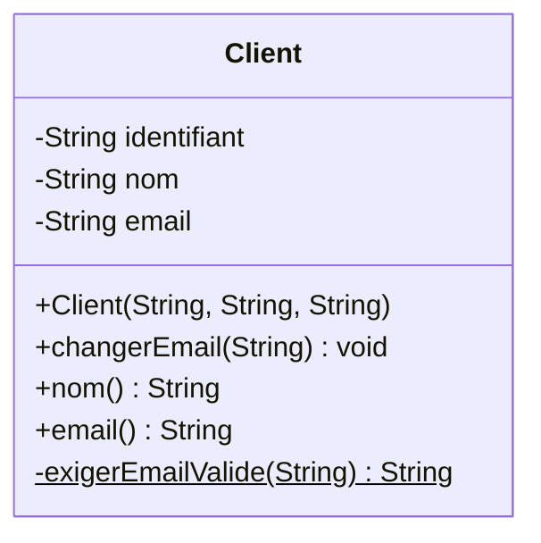
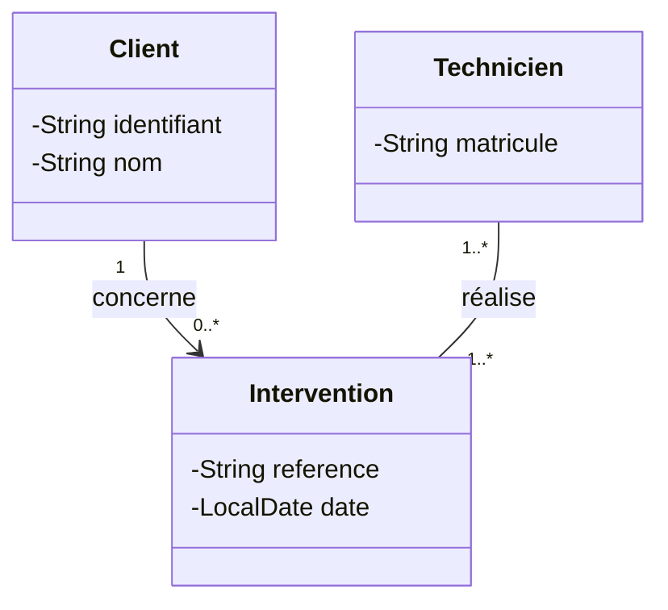
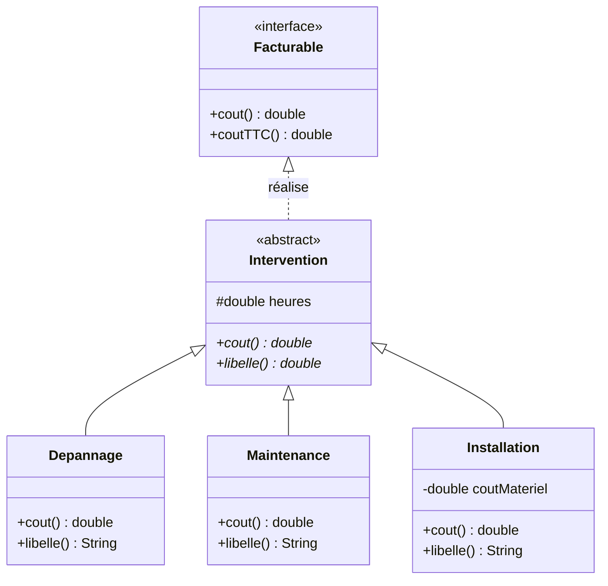
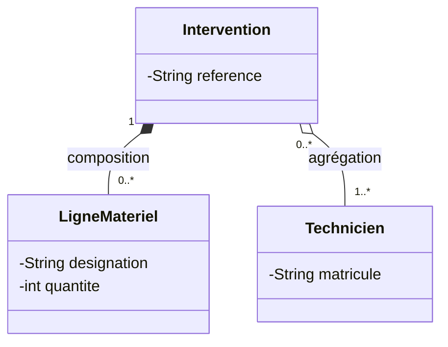
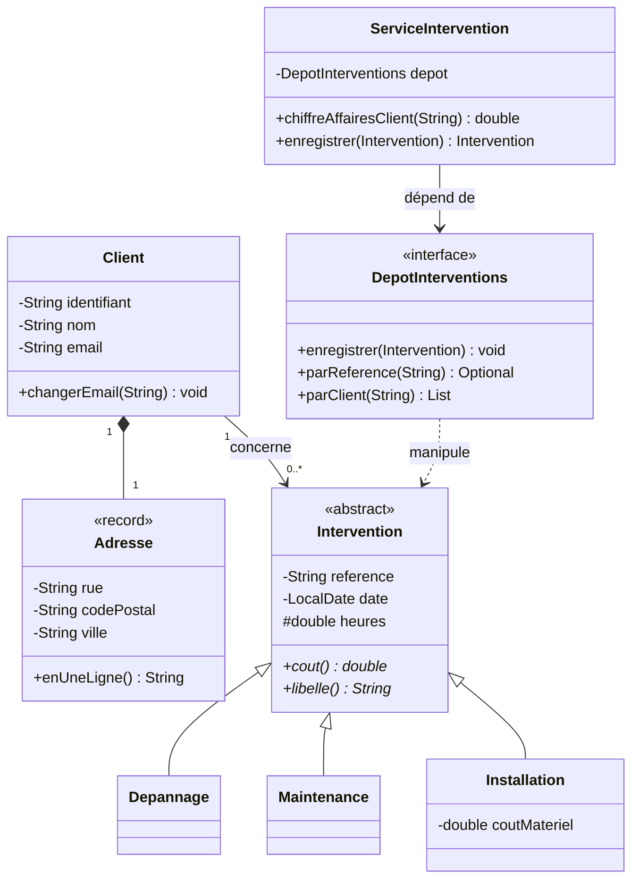

# Le diagramme de classes

::: info 🎯 Séance 25 · 2 h
À la fin de cette séance, vous savez :

- lire et écrire la notation d'une classe : attributs, opérations, visibilité ;
- exprimer une association avec sa multiplicité, et la traduire en code ;
- distinguer héritage, réalisation, composition et agrégation ;
- passer d'un diagramme au code Java, et inversement.

**Prérequis :** [Modéliser avec UML](/uml/)

**Livrable attendu :** le diagramme de classes du domaine « interventions », commité et relu
:::

C'est **le** diagramme de la conception objet. Il montre de quoi le système est fait et comment les pièces se relient. Vous en écrirez un avant chaque nouveau module, et vous en lirez toute votre carrière.

## La notation d'une classe

Une classe se dessine en trois compartiments : le nom, les attributs, les opérations.



### La visibilité

| Symbole | Portée | Java |
| --- | --- | --- |
| `+` | Public — accessible de partout | `public` |
| `-` | Privé — la classe seule | `private` |
| `#` | Protégé — la classe et ses sous-classes | `protected` |
| `~` | Paquetage | (défaut) |

Un diagramme où tous les attributs sont `+` signale une conception qui a oublié l'[encapsulation](/api-java/modeliser-poo). Les attributs se notent `-`, les opérations qui forment le contrat se notent `+`. C'est déjà une décision de conception, visible d'un coup d'œil.

::: tip Le soulignement
Un membre **souligné** est `static` : il appartient à la classe, pas aux instances. En Mermaid, on l'écrit avec un `$` final. Utile pour les constantes et les fabriques.
:::

## Les associations et leurs multiplicités

Une association relie deux classes. La **multiplicité** indique combien d'objets participent — c'est l'information la plus dense du diagramme.



| Notation | Lecture |
| --- | --- |
| `1` | Exactement un |
| `0..1` | Zéro ou un — donc **facultatif** |
| `0..*` ou `*` | Zéro ou plusieurs |
| `1..*` | Au moins un |
| `2..5` | Entre deux et cinq |

Lire le diagramme ci-dessus : *un client est concerné par zéro à plusieurs interventions ; une intervention concerne exactement un client*. Et : *une intervention est réalisée par au moins un technicien ; un technicien réalise au moins une intervention*.

::: warning La multiplicité est une règle de gestion
Écrire `1` plutôt que `0..1` a des conséquences directes : le champ ne peut pas être `null`, le constructeur doit l'exiger, et la base impose un `NOT NULL`. Ce n'est pas un détail de dessin — c'est une contrainte que le code devra faire respecter. Discutez-la avec le client avant de coder.
:::

### De l'association au code

```java
public class Intervention {
    private final Client client;        // multiplicité 1 → obligatoire, jamais null

    protected Intervention(String reference, Client client, ...) {
        this.client = Objects.requireNonNull(client, "client requis");
    }
}
```

```java
public class Client {
    private final List<Intervention> interventions = new ArrayList<>();  // 0..*
}
```

La règle de traduction est mécanique :

| Multiplicité | Traduction Java |
| --- | --- |
| `1` | Un champ, contrôlé non `null` au constructeur |
| `0..1` | Un champ, ou mieux un `Optional` en retour |
| `0..*` | Une `List` ou un `Set`, initialisée vide |
| `1..*` | Une collection, contrôlée non vide |

## Héritage et réalisation

Deux relations verticales, souvent confondues.



| Notation | Nom | Sens | Java |
| --- | --- | --- | --- |
| `<|--` trait plein | **Généralisation** | « est un » | `extends` |
| `<|..` trait pointillé | **Réalisation** | « sait faire » | `implements` |

Trois conventions à repérer sur ce diagramme :

- `<<abstract>>` et `<<interface>>` sont des **stéréotypes** : ils précisent la nature de l'élément.
- Une opération suivie d'une `*` (ou notée en italique dans la notation officielle) est **abstraite** : déclarée sans corps, chaque sous-classe doit la fournir.
- `#heures` est `protected` : accessible aux sous-classes qui en ont besoin pour calculer, mais fermé au reste du monde.

Ce diagramme est la vue exacte de ce que vous coderez en [séance 29](/api-java/abstraction-polymorphisme). Il tient en quinze lignes et remplace trois pages d'explications.

## Composition et agrégation

Deux façons de dire « contient », avec une différence de **cycle de vie**.



| Notation | Nom | Cycle de vie | Exemple |
| --- | --- | --- | --- |
| `*--` losange plein | **Composition** | La partie **meurt** avec le tout | Les lignes de matériel d'une intervention |
| `o--` losange creux | **Agrégation** | La partie **survit** au tout | Les techniciens affectés |

Le test décisif : *si je supprime l'intervention, que devient l'autre objet ?* Les lignes de matériel n'ont plus de sens seules — c'est une composition. Le technicien, lui, continue d'exister et part sur une autre intervention — c'est une agrégation.

::: tip En pratique
La distinction se traduit dans le code par qui **crée** l'objet. En composition, l'intervention construit ses lignes de matériel et ne les expose jamais directement. En agrégation, le technicien est créé ailleurs et simplement **passé** à l'intervention — exactement comme le dépôt injecté dans le service.
:::

## Le diagramme complet du domaine



Une chose mérite d'être remarquée : `ServiceIntervention` pointe vers l'**interface** `DepotInterventions`, jamais vers une implémentation. C'est l'inversion de dépendance, **visible sur le dessin**. Un relecteur qui verrait une flèche du service vers `DepotPostgres` saurait immédiatement que la conception est fautive — sans lire une ligne de code.

## Ce qu'il ne faut pas mettre

Un diagramme de classes exhaustif est illisible et faux au bout d'une semaine. Trois règles :

- **Une vue = une question.** Un diagramme pour le domaine, un pour l'architecture en couches. Pas un pour tout.
- **Pas de getters/setters.** Ils encombrent sans rien apprendre. On ne montre que les opérations qui portent du sens métier.
- **Pas les classes techniques.** Les DTO, les contrôleurs et les classes utilitaires n'ont rien à faire dans un diagramme de **domaine**.

---

## Auto-évaluation

Répondez de mémoire avant de déplier la correction.

::: details 1. Quelle différence entre `<|--` et `<|..` ?
Le trait plein `<|--` est une **généralisation** : « est un », traduite par `extends`. Le trait pointillé `<|..` est une **réalisation** : « sait faire », traduite par `implements`. `Depannage` est une `Intervention` ; `Intervention` sait être `Facturable`. La confusion est fréquente parce que les deux flèches montent — c'est la nature du trait qui les distingue.
:::

::: details 2. Composition ou agrégation entre une commande et ses lignes de commande ?
**Composition** (`*--`). Une ligne de commande n'a aucune existence en dehors de sa commande : si la commande est supprimée, ses lignes disparaissent. Le test est toujours le même — que devient la partie si le tout disparaît ? Si elle survit et peut être rattachée ailleurs, c'est une agrégation.
:::

::: details 3. Que révèle une multiplicité `0..1` sur une association obligatoire selon le client ?
Une contradiction à lever avant de coder. `0..1` autorise l'absence : le champ pourra être `null`, le code devra traiter ce cas et la base l'acceptera. Si le client affirme que la donnée est toujours présente, la multiplicité doit être `1` — et le constructeur devra la refuser à `null`. C'est typiquement le genre d'ambiguïté que le diagramme fait remonter, et que le code seul laisserait passer.
:::

**Critères de réussite de la séance**

- ☐ aucun attribut n'est noté `+`
- ☐ chaque association porte une multiplicité aux deux extrémités
- ☐ composition et agrégation sont employées à bon escient, et justifiables
- ☐ le service pointe vers une interface, pas vers une implémentation

Voyons maintenant le système en mouvement : [Les diagrammes dynamiques](/uml/dynamique).
