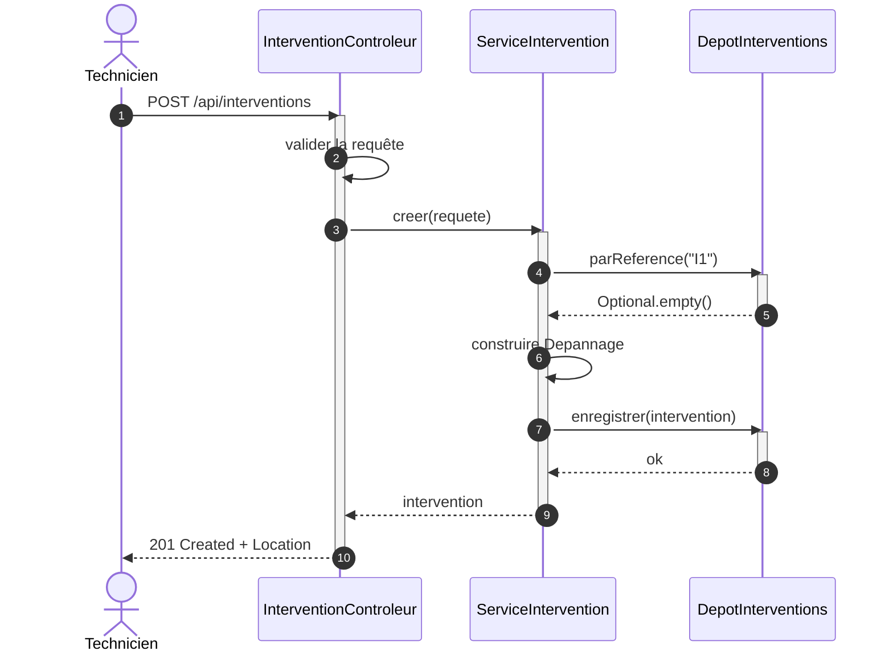
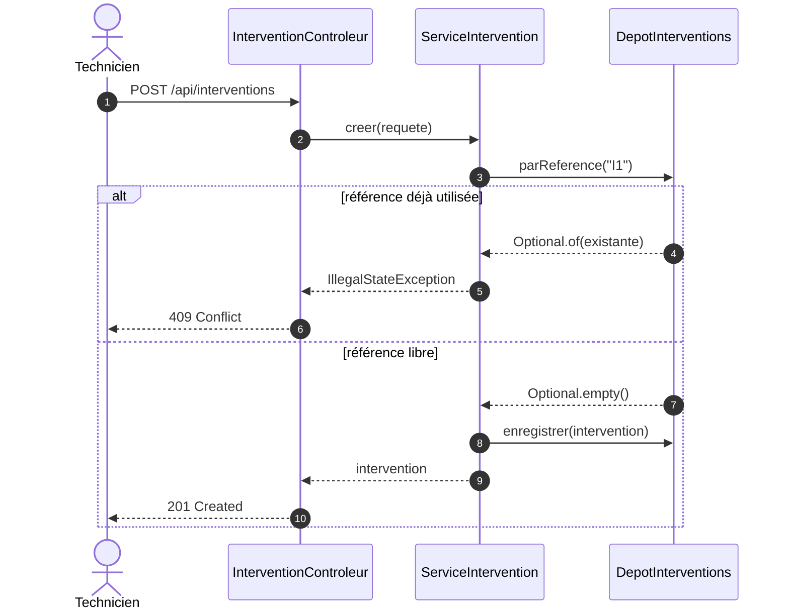
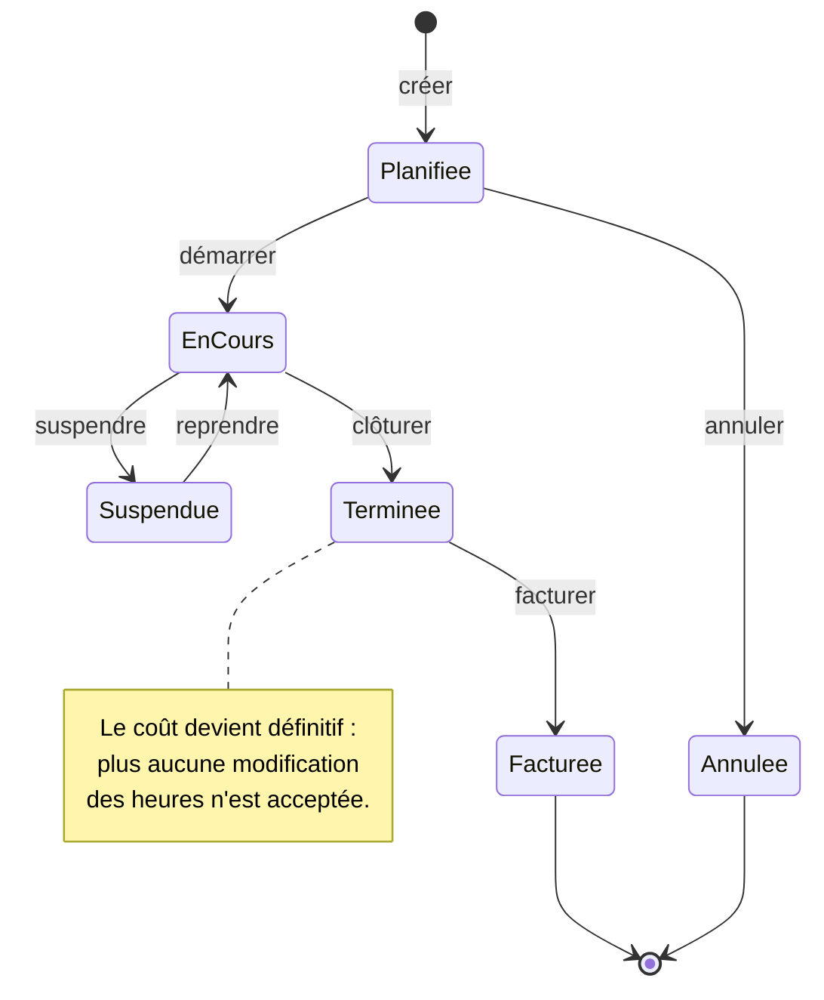
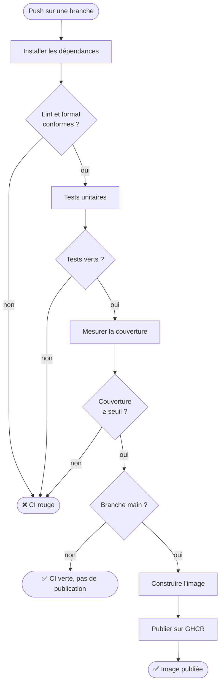
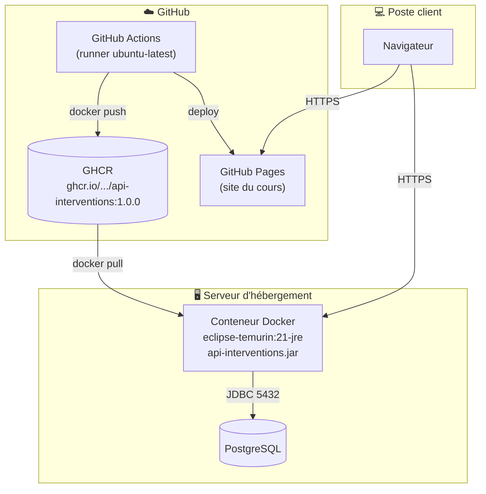

# Les diagrammes dynamiques

::: info 🎯 Séance 26 · 2 h
À la fin de cette séance, vous savez :

- décrire une collaboration entre objets par un diagramme de séquence ;
- représenter le cycle de vie d'un objet par un diagramme d'états ;
- documenter un enchaînement — métier ou pipeline — par un diagramme d'activité ;
- situer les composants sur leur infrastructure avec un diagramme de déploiement.

**Prérequis :** [Le diagramme de classes](/uml/classes)

**Livrable attendu :** un diagramme de séquence et un diagramme d'états, commités et relus
:::

Le diagramme de classes montre une photographie : ce qui existe. Les diagrammes dynamiques montrent le film : **ce qui se passe**, dans quel ordre, et sous quelles conditions.

## Le diagramme de séquence

Il décrit **qui appelle qui, dans quel ordre**, pour un scénario précis. C'est le diagramme le plus utile en conception détaillée — et celui que vous dessinerez au tableau lors d'une revue.



Les éléments à connaître :

| Élément | Notation | Sens |
| --- | --- | --- |
| **Ligne de vie** | trait vertical | La durée d'existence du participant |
| **Barre d'activation** | rectangle | Le participant exécute quelque chose |
| **Message synchrone** | flèche pleine `->>` | Appel : l'émetteur attend |
| **Retour** | flèche pointillée `-->>` | Réponse |
| **Auto-appel** | flèche vers soi-même | Traitement interne |

Le diagramme ci-dessus dit quelque chose que le code disperse sur quatre fichiers : le contrôleur **valide** puis délègue, le service **vérifie l'unicité avant d'écrire**, et le `201` n'est renvoyé qu'après l'enregistrement effectif.

### Les cas alternatifs

Un scénario nominal ne suffit jamais. Les fragments combinés décrivent les branches :



| Fragment | Usage |
| --- | --- |
| `alt` / `else` | Alternative selon une condition |
| `opt` | Traitement optionnel, sans branche inverse |
| `loop` | Répétition |
| `par` | Traitements parallèles |

::: tip Le diagramme de séquence est un plan de test
Chaque branche `alt` correspond à un test à écrire. Ce diagramme annonce deux cas : `201` sur référence libre, `409` sur conflit — précisément les deux tests de la [séance 31](/api-java/tester-api). Dessiner les alternatives, c'est déjà lister ce qu'il faudra couvrir.
:::

## Le diagramme d'états

Il décrit le **cycle de vie d'un seul objet** : les états qu'il peut prendre et les événements qui le font passer de l'un à l'autre.



Ce diagramme énonce des règles qu'aucune autre vue ne rend visibles :

- on ne peut **pas** facturer une intervention non terminée ;
- une intervention annulée est un état **final** — on n'en revient pas ;
- « suspendre » n'est possible que depuis « en cours ».

### Du diagramme au code

Ces règles se traduisent directement, et le diagramme devient la spécification de la méthode :

```java
public enum StatutIntervention { PLANIFIEE, EN_COURS, SUSPENDUE, TERMINEE, FACTUREE, ANNULEE }

public void facturer() {
    if (statut != StatutIntervention.TERMINEE) {
        throw new IllegalStateException(
                "seule une intervention terminée peut être facturée (statut : " + statut + ")");
    }
    this.statut = StatutIntervention.FACTUREE;
}
```

::: warning L'erreur à ne pas commettre
Un `setStatut(String)` public laisse n'importe quel appelant passer de `PLANIFIEE` à `FACTUREE` en sautant tout le cycle. Le diagramme d'états **est** la liste des transitions autorisées : chacune mérite sa méthode métier — `demarrer()`, `cloturer()`, `facturer()` — qui vérifie l'état de départ.
:::

## Le diagramme d'activité

Il décrit un **enchaînement d'actions**, avec ses décisions et ses parallélismes. Proche de l'organigramme, il documente aussi bien un processus métier qu'un pipeline de CI.



C'est exactement le pipeline du [TP 5](/tp/tp5-api-livree), sous une forme discutable en réunion. Un diagramme d'activité est souvent le meilleur moyen de faire valider une chaîne d'automatisation par quelqu'un qui ne lira jamais le YAML.

| Élément | Notation |
| --- | --- |
| Nœud initial / final | forme arrondie |
| Action | rectangle |
| Décision | losange, avec les conditions sur les flèches |

## Le diagramme de déploiement

Il montre **où tourne quoi** : quel artefact est installé sur quel nœud, et par quels protocoles ils communiquent. C'est le diagramme le plus proche des préoccupations DevOps.



Trois informations qu'aucun autre diagramme ne porte :

- **la version déployée** (`1.0.0`) — celle qui relie le code à ce qui tourne réellement ;
- **les protocoles et ports** — HTTPS vers l'API, JDBC 5432 vers la base ;
- **les frontières d'infrastructure** — ce qui est chez GitHub, ce qui est chez l'hébergeur.

::: tip Le diagramme qu'on regarde en incident
C'est celui-ci. À 3 h du matin, la question n'est pas « quelles sont les classes ? » mais « qui parle à quoi, et par où ». Un diagramme de déploiement à jour fait gagner un temps considérable — et se maintient facilement puisqu'il change rarement.
:::

## Quel diagramme pour quelle question

| La question posée | Le diagramme |
| --- | --- |
| Qui utilise le système, pour quoi faire ? | Cas d'utilisation |
| De quoi est-il fait ? | Classes |
| Comment se déroule ce scénario ? | Séquence |
| Quels états peut prendre cet objet ? | États |
| Quel est l'enchaînement du processus ? | Activité |
| Où est-ce installé ? | Déploiement |

Le réflexe professionnel n'est pas « je fais tous les diagrammes », mais « j'ai une question, quel diagramme y répond ». Un projet bien documenté en compte trois ou quatre à jour, pas quatorze périmés.

---

## Auto-évaluation

Répondez de mémoire avant de déplier la correction.

::: details 1. Séquence ou activité pour décrire la création d'une intervention ?
**Séquence**, si l'on veut montrer quels objets collaborent — contrôleur, service, dépôt — et dans quel ordre ils s'appellent. **Activité**, si l'on veut montrer l'enchaînement des étapes sans se soucier de qui les exécute. Le diagramme de séquence répond à « qui », celui d'activité à « quoi ensuite ».
:::

::: details 2. Que révèle un diagramme d'états sur la conception d'une classe ?
Que les transitions doivent être des **méthodes métier**, pas un `setStatut` public. Chaque flèche du diagramme correspond à une opération qui vérifie l'état de départ avant de changer d'état. Le diagramme énumère aussi les transitions **interdites** — passer de « planifiée » à « facturée » — que le code devra refuser explicitement.
:::

::: details 3. Pourquoi le diagramme de déploiement intéresse-t-il particulièrement le DevOps ?
Parce qu'il est le seul à montrer l'exécution réelle : quelle version d'image tourne sur quel nœud, par quels ports transitent les échanges, où passe la frontière entre l'infrastructure gérée et celle du fournisseur. C'est la vue qu'on consulte pendant un incident, et celle qui permet de raisonner sur la sécurité réseau.
:::

**Critères de réussite de la séance**

- ☐ le diagramme de séquence comporte au moins un fragment `alt`
- ☐ chaque branche `alt` est identifiable comme un test à écrire
- ☐ le diagramme d'états possède un état initial et au moins un état final
- ☐ aucune transition du diagramme d'états ne se traduit par un `setStatut` public

Ces modèles vont maintenant devenir du code : [Une API objet en Java](/api-java/).
