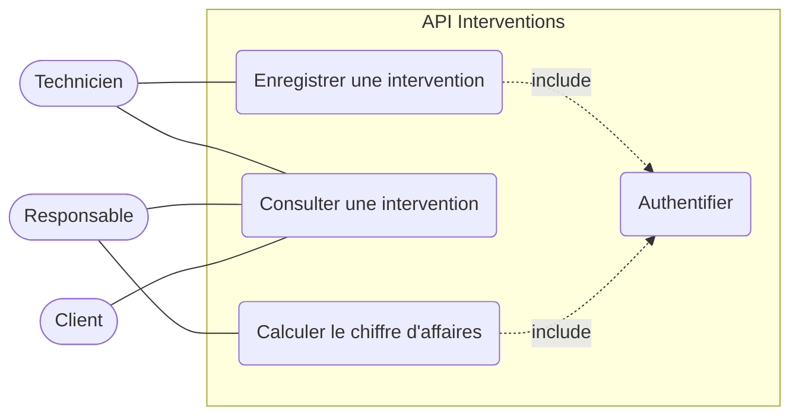
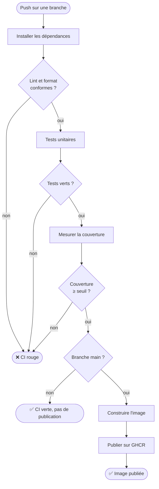
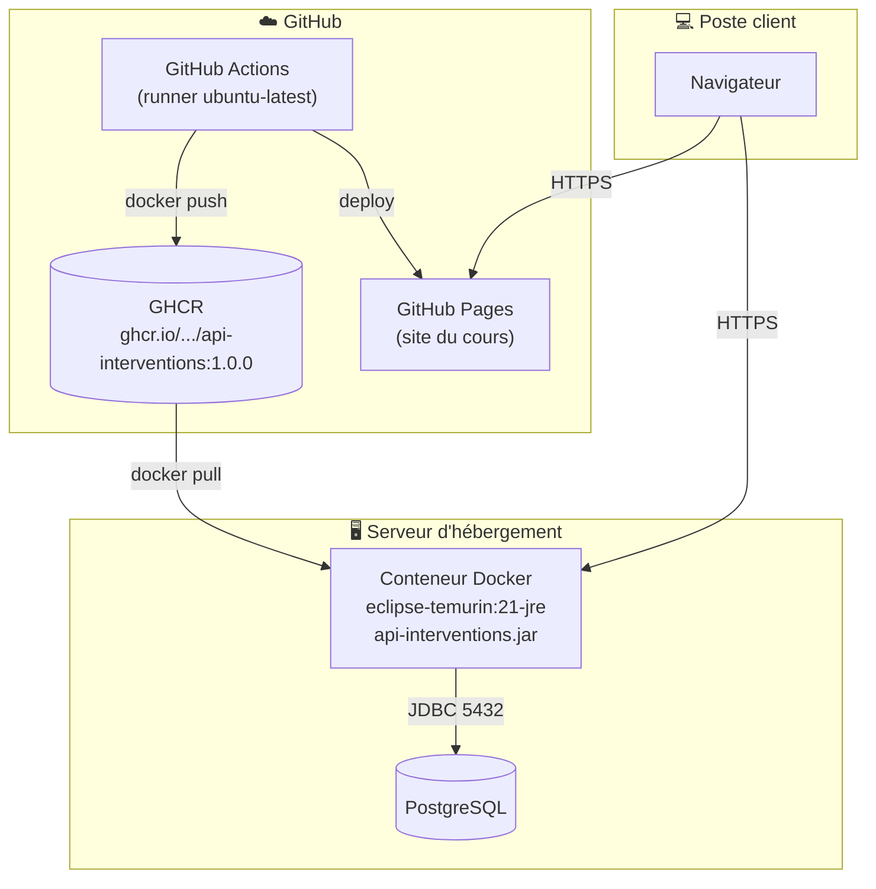

# Modéliser avec UML

::: info 🎯 Séance 24 · 2 h
À la fin de cette séance, vous savez :

- expliquer à quoi sert un modèle, et à quoi il ne sert pas ;
- écrire un diagramme **sous forme de code**, versionné et relu en Pull Request ;
- produire un diagramme de cas d'utilisation à partir d'un besoin exprimé ;
- documenter un processus et une infrastructure par les diagrammes d'activité et de déploiement.

**Prérequis :** [Branches & Pull Requests](/git-github/branches-pr)

**Livrable attendu :** un diagramme de cas d'utilisation versionné, ajouté au dépôt par une PR
:::

**UML** (*Unified Modeling Language*) est un langage graphique normalisé pour décrire un système logiciel. En entreprise, vous le rencontrerez dans les dossiers de conception, les spécifications et les revues d'architecture — et à l'examen.

Cette séance traite les diagrammes qui décrivent le **système** : ce qu'il rend comme service, comment se déroulent ses processus, où il est installé. Les diagrammes de **conception objet** — classes, associations, états, séquence — ne sont pas relégués dans un chapitre à part : ils sont enseignés avec la notion de POO qu'ils servent, à partir de la [séance 26](/api-java/modeliser-poo).

## À quoi sert un modèle

Trois usages, très différents :

| Usage | Question posée | Durée de vie |
| --- | --- | --- |
| **Se mettre d'accord** | « Est-ce bien ce que vous voulez ? » | Le temps d'une réunion |
| **Concevoir** | « Quelles classes, quelles responsabilités ? » | Le temps de la conception |
| **Documenter** | « Comment ça marche, déjà ? » | Toute la vie du projet |

Le troisième est le plus utile et le plus négligé. Un développeur qui arrive sur un projet de 200 classes n'a pas besoin des 200 : il a besoin d'**un** schéma qui montre les dix qui comptent.

::: warning Le modèle n'est pas le code
Un diagramme est une **simplification volontaire**. Il ne remplace pas le code, il en donne une vue. Le jour où le modèle contredit le code, c'est le code qui a raison — d'où l'importance de versionner les deux ensemble.
:::

## Les diagrammes qui comptent

UML 2 en définit quatorze. Dans la vie professionnelle, six couvrent l'essentiel — et ce cours les traite là où ils servent :

| Diagramme | Répond à | Traité en |
| --- | --- | --- |
| **Cas d'utilisation** | Qui fait quoi avec le système ? | S24 (ici) |
| **Activité** | Quel est l'enchaînement du processus ? | S24 (ici) |
| **Déploiement** | Où tourne quoi ? | S24 (ici) |
| **Classes** | De quoi est fait le système ? | [S26](/api-java/modeliser-poo) et [S28](/api-java/abstraction-polymorphisme) |
| **États** | Quel est le cycle de vie d'un objet ? | [S27](/api-java/associations-cycle-vie) |
| **Séquence** | Comment les objets collaborent dans le temps ? | [S30](/api-java/tester-api) |

Les huit autres (composants, paquetages, communication, temps…) existent, sont légitimes, et servent rarement. Mieux vaut maîtriser six diagrammes que d'en reconnaître quatorze.

## Le diagramme comme code

C'est le point qui rattache UML à tout ce que vous avez appris depuis la séance 1.

Un diagramme dessiné dans un logiciel puis exporté en image pose quatre problèmes :

- il **n'est pas diffable** : un `git diff` sur un PNG n'apprend rien ;
- il **n'est pas relisible en PR** : on ne commente pas une ligne d'une image ;
- il **diverge du code** dès la première modification faite dans l'urgence ;
- il exige un **logiciel** que tout le monde n'a pas.

Écrit en texte, le diagramme redevient un fichier comme les autres :

```
   diagramme.mmd  ──►  commité  ──►  relu en Pull Request
        │                                    │
        │                                    ▼
        └────────────────────────►  rendu automatiquement
                                    par GitHub et par le site
```

::: tip Ce que change le diff
Modifier une multiplicité de `1` à `0..*` produit une ligne de diff que le relecteur voit immédiatement, et sur laquelle il peut commenter. C'est une décision de conception qui devient **discutable en revue**, au même titre qu'une signature de méthode.
:::

## Deux outils, deux usages

| | **Mermaid** | **PlantUML** |
| --- | --- | --- |
| Rendu par GitHub | ✅ nativement dans le Markdown | ❌ nécessite un service |
| Couverture UML | Classes, séquence, états, ER | Les 14 diagrammes |
| Cas d'utilisation | ❌ absent | ✅ notation complète |
| Installation | aucune | serveur ou extension VS Code |

**Mermaid** est retenu pour ce cours : GitHub l'affiche directement dans les fichiers Markdown, les Issues et les Pull Requests, sans outil ni configuration. C'est ce qui permet de déposer un diagramme dans une PR et de le voir rendu.

**PlantUML** reste supérieur dès qu'on sort des diagrammes courants — à commencer par les cas d'utilisation, que Mermaid ne sait pas produire. C'est aussi une leçon professionnelle : **on choisit l'outil selon le besoin**, on ne plie pas le besoin à l'outil.

Pour afficher les diagrammes sur un site VitePress, un greffon est nécessaire :

```bash
npm i -D vitepress-plugin-mermaid mermaid
```

```js
// docs/.vitepress/config.mjs
import { defineConfig } from 'vitepress'
import { withMermaid } from 'vitepress-plugin-mermaid'

export default withMermaid(defineConfig({
  // ...
}))
```

## Le diagramme de cas d'utilisation

Il répond à une seule question : **qui** peut faire **quoi** avec le système. C'est le premier diagramme d'un projet, celui qu'on montre au client.

Trois éléments :

- l'**acteur** — un rôle extérieur au système (un humain, ou un autre système) ;
- le **cas d'utilisation** — un service rendu, formulé à l'infinitif ;
- la **frontière** — ce qui est dans le système, et ce qui n'y est pas.

La notation officielle, en PlantUML :

```text
@startuml
left to right direction

actor "Technicien"   as tech
actor "Responsable"  as resp
actor "Client"       as cli

rectangle "API Interventions" {
  usecase "Enregistrer une intervention"    as UC1
  usecase "Consulter une intervention"      as UC2
  usecase "Calculer le chiffre d'affaires"  as UC3
  usecase "Authentifier"                    as UC4
  usecase "Notifier le client"              as UC5
}

tech --> UC1
tech --> UC2
resp --> UC3
resp --> UC2
cli  --> UC2

UC1 .> UC4 : <<include>>
UC3 .> UC4 : <<include>>
UC1 .> UC5 : <<extend>>
@enduml
```

Faute de notation dédiée, Mermaid permet une approximation lisible — utile quand on tient à rester dans un seul outil :



### `include` et `extend`

Deux relations à ne pas confondre :

| Relation | Sens | Exemple |
| --- | --- | --- |
| `<<include>>` | Le cas **appelle toujours** l'autre | Enregistrer inclut Authentifier |
| `<<extend>>` | L'autre s'ajoute **parfois**, sous condition | Enregistrer peut déclencher Notifier |

`include` est une obligation, `extend` une option. Se tromper inverse le sens du besoin : dire que l'authentification « étend » l'enregistrement revient à annoncer qu'on peut enregistrer sans être authentifié.

### Trois erreurs fréquentes

- **Décrire des écrans plutôt que des services.** « Afficher le formulaire » n'est pas un cas d'utilisation ; « Enregistrer une intervention » en est un. Le cas décrit une **valeur rendue**, pas une interface.
- **Mettre la base de données en acteur.** Un acteur est extérieur et **déclenche** l'action. La base est un composant interne.
- **Confondre acteur et personne.** « Marie » n'est pas un acteur, « Technicien » l'est. Une même personne peut jouer deux rôles.

## Le diagramme d'activité

Il décrit un **enchaînement d'actions**, avec ses décisions et ses parallélismes. Proche de l'organigramme, il documente aussi bien un processus métier qu'un pipeline de CI.



C'est exactement le pipeline du [TP 5](/tp/tp5-api-livree), sous une forme discutable en réunion. Un diagramme d'activité est souvent le meilleur moyen de faire valider une chaîne d'automatisation par quelqu'un qui ne lira jamais le YAML.

| Élément | Notation |
| --- | --- |
| Nœud initial / final | forme arrondie |
| Action | rectangle |
| Décision | losange, avec les conditions sur les flèches |

## Le diagramme de déploiement

Il montre **où tourne quoi** : quel artefact est installé sur quel nœud, et par quels protocoles ils communiquent. C'est le diagramme le plus proche des préoccupations DevOps.



Trois informations qu'aucun autre diagramme ne porte :

- **la version déployée** (`1.0.0`) — celle qui relie le code à ce qui tourne réellement ;
- **les protocoles et ports** — HTTPS vers l'API, JDBC 5432 vers la base ;
- **les frontières d'infrastructure** — ce qui est chez GitHub, ce qui est chez l'hébergeur.

::: tip Le diagramme qu'on regarde en incident
C'est celui-ci. À 3 h du matin, la question n'est pas « quelles sont les classes ? » mais « qui parle à quoi, et par où ». Un diagramme de déploiement à jour fait gagner un temps considérable — et se maintient facilement puisqu'il change rarement.
:::

## Où ranger les diagrammes

```
docs/
└── conception/
    ├── cas-utilisation.md      ← le diagramme et son explication
    ├── classes.md
    └── deploiement.md
```

Les placer dans `docs/` les fait apparaître sur le site généré : la documentation de conception est **publiée en même temps que le code**, par le même pipeline. C'est le principe de la [séance 12](/pages/deployer-site) appliqué à la conception.

---

## Auto-évaluation

Répondez de mémoire avant de déplier la correction.

::: details 1. Pourquoi écrire ses diagrammes en texte plutôt que les dessiner ?
Parce qu'un fichier texte est diffable, relisible en Pull Request et versionné avec le code. Modifier une multiplicité produit une ligne de diff que le relecteur peut commenter ; modifier un PNG ne produit qu'un « fichier binaire modifié ». Le diagramme redevient un artefact de développement, pas une pièce jointe qui vieillit dans un dossier partagé.
:::

::: details 2. « Consulter une intervention » inclut ou étend « Authentifier » ?
Elle l'**inclut** : l'authentification est obligatoire et a lieu à chaque consultation. `extend` désignerait un comportement optionnel, déclenché sous condition — par exemple « Notifier le client », qui ne se produit que dans certains cas. Confondre les deux inverse le sens du besoin exprimé.
:::

::: details 3. Un collègue propose « Afficher la liste des interventions » comme cas d'utilisation. Qu'en pensez-vous ?
C'est une action d'interface, pas un service métier. Le cas d'utilisation décrit la valeur rendue à un acteur — ici « Consulter les interventions d'un client » — indépendamment de la façon dont l'écran est fait. Formuler le diagramme en termes d'écrans le rend obsolète à la première refonte de l'interface.
:::

::: details 4. Pourquoi le diagramme de déploiement intéresse-t-il particulièrement le DevOps ?
Parce qu'il est le seul à montrer l'exécution réelle : quelle version d'image tourne sur quel nœud, par quels ports transitent les échanges, où passe la frontière entre l'infrastructure gérée et celle du fournisseur. C'est la vue qu'on consulte pendant un incident, et celle qui permet de raisonner sur la sécurité réseau.
:::

**Critères de réussite de la séance**

- ☐ le diagramme est un fichier texte commité, pas une image
- ☐ les cas d'utilisation sont formulés à l'infinitif et décrivent un service
- ☐ au moins une relation `include` est justifiée
- ☐ le diagramme a été relu par un binôme en Pull Request

Passons au code — et aux diagrammes qui l'accompagnent : [Une API objet en Java](/api-java/).
